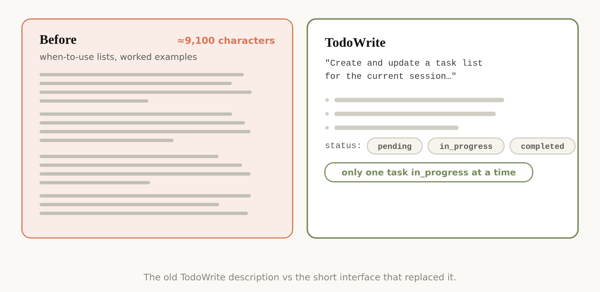

# Claude 5 代模型的上下文工程新规则

我之前写过如何更好地[提示最新一代 Claude 5 模型](https://claude.com/blog/a-field-guide-to-claude-fable-finding-your-unknowns)，以及如何与它们迭代协作来探索你想构建的东西。

但当你向 Claude 发送消息时，提示词（prompt）只是它接收到的上下文的一小部分。你的大部分上下文来自系统提示（system prompt）、Skills、CLAUDE.md 文件、记忆以及其他来源。我们称之为[上下文工程](https://www.anthropic.com/engineering/effective-context-engineering-for-ai-agents)（Context Engineering），它对你使用 Claude Code 或构建自己的智能体时产生的结果有巨大影响。

与提示词不同，上下文是跨多个请求通用使用的，因此不能过于具体。那么，如何为 Claude 构建这些通用的提示和指导，尤其是当你不知道用户的提示可能是什么时？

这可能出乎意料地困难，因为 Claude 自身的能力在不断演进。最近，我们注意到在提示最新一代 Claude 模型的方式上出现了巨大跃升。**针对 Claude Opus 5 和 Claude Fable 5 这样的先进模型，我们删除了 Claude Code 系统提示中超过 80% 的内容**，并且在我们的编码评估中没有出现可测量的损失。

以下是我们在提示这一新类别模型方面的经验总结，以及你如何利用它来更新你的上下文工程。我们已将这些最佳实践内置到 `claude doctor` 中；在 Claude Code 中使用 `/doctor` 命令来优化你的 Skills 和 CLAUDE.md 文件。

## Unhobbling Claude（解除束缚）

总体而言，我们发现自己在过度约束（overconstraining）Claude Code，无论是通过系统提示，还是通过 CLAUDE.md 文件和 Skills。

例如，当我们阅读自己内部使用 Claude Code 的记录时，会看到单个请求中出现多条冲突的消息，比如"适当保留文档"或"绝对不要添加注释"——这是系统提示、Skills 和用户请求相互冲突的表现。

Claude 通常能理解用户的意图并得出正确答案。但它必须更仔细地思考这些重叠和冲突的消息，才能决定做什么。

这些约束曾经是避免最坏情况所必需的。但我们后来发现，可以删除其中许多约束，让模型依靠周围的上下文和判断力。

此外，Claude Code 现在拥有更多工具。Claude 过去依赖 CLAUDE.md 作为记忆、信息和指导的来源。现在我们有了 memory、artifacts 和 skills，它可以用这些工具创建新的方式来跨会话加载和共享上下文。

阅读[文档](https://code.claude.com/docs/en/overview)了解更多

## 过去与现在

有许多以前的上下文工程最佳实践已经变成了迷思，包括：

### 过去：给规则

### 现在：靠判断

当我们首次推出 Claude Code 时，需要确保 Claude 避免最坏情况，比如删除文件。这意味着我们会给出特别强的指导，但这些指导并不总是正确的。例如，在系统提示中我们曾经说：

*代码中：默认不写注释。绝不写多段文档字符串或多行注释块——最多一行简短注释。除非用户明确要求，否则不要创建规划、决策或分析文档——从对话上下文中工作，而不是中间文件。*

但对于某些提示子集，这个指导是错误的。在文档的情况下，用户可能有自己的偏好，或者非常复杂的代码的特定部分可能需要多行注释块。

如果没有这些护栏（guardrails），旧模型写的注释在许多情况下会是错误的，我们不得不接受这种权衡。但更新的模型有更好的判断力，无需明确规则就能很好地处理这些决策。

在新的系统提示中，我们说：*编写与周围代码风格一致的代码：匹配其注释密度、命名和习惯用法。*

### 过去：给示例

### 现在：设计接口

工具使用的第一法则曾经是给 Claude 示例来展示如何使用它们。但在我们最新的模型中，我们发现给示例实际上会将它们限制在某个探索空间内。

与其使用示例，不如更多地思考你的工具、脚本和文件的设计——Claude 有哪些参数，以及如何让它们更具表达力？

例如，在 Todo 工具示例中，仅仅将状态列为 pending、in_progress 和 completed 之间的枚举，就能向 Claude 暗示如何使用它。"保持一个项目处于 in_progress 状态"这条指令有助于定义我们期望的行为。

### 过去：全部前置

### 现在：渐进披露

因为 Claude Code 专注于编码，我们的系统提示包含了关于如何进行代码审查和验证的详细信息。这些并不总是需要的，但当需要时，它们是关键信息。

从那时起，Claude Code 在运用渐进式披露（progressive disclosure）方面变得非常擅长——在正确的时间加载正确的上下文。例如，我们将验证和代码审查移到它们自己的 Skills 中，Claude Code 可以选择性地调用。

但渐进式披露不仅仅适用于 Skills，我们也将其用于工具。我们的一些工具是"延迟加载（deferred loading）"的，这意味着智能体必须在使用它们之前使用 ToolSearch 搜索它们的完整定义。这样我们就能拥有更多工具（例如我们的 Task 工具），它们在需要之前不会占用上下文。

同样的原则也可以应用于你自己的 CLAUDE.md 和 Skill.md 文件。一个常见的误区是，你想让这些成为每个你*可能*遇到的已知实践的中央仓库，因为否则 Claude 找不到它。相反，[考虑建立一个可以在正确时间加载的文件树](https://claude.com/blog/a-harness-for-every-task-dynamic-workflows-in-claude-code)。

### 过去：重复强调

### 现在：简洁描述

早期的 Claude 模型有时需要重复的指令，或者更容易听从上下文窗口末尾而不是开头的指令。这意味着我们的系统提示有时会在主系统提示中引用工具，同时在工具描述中也有指令。

我们发现可以删除这些重复示例，把如何使用工具的指令放在工具描述中，而不是系统提示中。

### 过去：文件记忆

### 现在：自动记忆

我们过去鼓励用户将内容保存到 Claude 的记忆中，通过使用 `#` 快捷键自动写入他们的 [CLAUDE.md](http://claude.md/)。现在，Claude 会自动保存与工作和你相关的记忆。

### 过去：简单规约

### 现在：丰富引用

在计划模式下，Claude Code 严重依赖带有计划的 markdown 文件。将这些文件存储为计划有助于 Claude 在需要时引用它们。另一个类似的最佳实践是在代码库中存储规约（specs），供 Claude 在更长的项目中引用。

但我们发现 Claude 可以处理越来越复杂的引用（references）。不只是简单的 markdown 文件，Claude 还可以引用由我们新的 artifacts 功能创建的 HTML artifacts。

你也可以以代码的形式给 Claude 引用。规约也可以是详细的测试套件，或者 Claude 可能移植的不同代码库中的函数。

评判标准（Rubrics）是另一种形式的引用。评判标准允许 Claude 尝试验证你在特定领域的品味（例如，好的 API 设计是什么样的），通过使用[动态工作流](https://claude.com/blog/a-harness-for-every-task-dynamic-workflows-in-claude-code)并启动带有这些评判标准的验证器智能体。

## 将这些应用到你的上下文中

将所有这些综合起来，当你组装上下文时，这看起来是什么样的？

### System Prompt（系统提示）

系统提示与产品上下文紧密相关。它告诉 Claude 它在哪个产品中操作以及它在做什么。对于 Claude Code，你可能永远不会修改它，但如果你正在构建自己的 agent harness，这是你应该花大量时间的地方。

### CLAUDE.md

保持你的 CLAUDE.md 轻量级，简要描述你的仓库是做什么的，但将大部分上下文预算（**token 配额**）花在代码库内部的陷阱上。例如，你可能组织代码将类型保存在一个单一的文件中，而不是其他任何地方。避免陈述 Claude 通过查看你的文件系统或仓库就能知道的"显而易见"的事情。

大量使用渐进式披露。例如，如果你有几个独特的验证工作的指令，创建一个验证 Skill 并从你的 CLAUDE.md 中引用它。

### Skills

将 Skills 视为轻量级指南，让 Claude 在需要时找到信息。避免让它们过度约束，除非在高度重要的领域。

对于长 Skills，尽可能多地使用渐进式披露——将其分成多个文件并拆分出来。

当 Skills 编码你、你的团队或产品特有的特定观点、知识或最佳实践时，效果最好。

### References（引用）

你可以 `@` 提及文件以将它们作为引用包含进来。引用允许 Claude 参考当前计划的深入信息。

这可能是规约文件、模型图，甚至是整个代码库。通常，你应该更偏好代码形式的文件，因为它以 Claude 非常熟悉的语言提供清晰、高保真的指令。例如，设计的 HTML 模型图通常会比设计描述或截图产生更好的结果。

## 尝试简化

在你的系统提示、Skills 和 CLAUDE.md 文件中，你可能需要像我们一样简化。我们推出了一个名为 `claude doctor` 的新命令，它也会自动帮助你完成此操作。有关专门提示更高级模型的更多详细信息，请查看我们的 [Fable 实地指南](https://claude.com/blog/a-field-guide-to-claude-fable-finding-your-unknowns)。

*本文由 Anthropic 技术成员（Member of Technical Staff）Thariq Shihipar 撰写。*
