# Living-Harness：交互智能体进化器

Yuetian Du 1, Yucheng Wang 1, He Xu 1, Jiexu Xu 4, Shanwen Tan 1, Bing Zhao 2,
Boyu Yang 2, Zhijie Xu 5, Ming Kong 1, Hu Wei 2, Jie Liu 3, Qiang Zhu 1

###### 摘要

大语言模型（LLM）智能体可能在回合内从失败中恢复，或在重试后成功，但相同的执行失败会在后续任务中再次出现，因为回合后的反馈很少修订指导未来交互的持久性框架。静态框架通过固定的工具、上下文、记忆和工作流结构提高可靠性，但在部署后保持不变。我们提出 Living-Harness（自进化智能体框架），这是一个自进化的智能体框架，它将每个完成的轨迹（Trajectory）及其评估器（Evaluator）信号转换为后验证据（Posterior evidence），用于有界框架更新。在领域级 Evolution-SOP（进化标准操作程序，Standard Operating Procedure）的指导下，Living-Harness 提取回合抽象和结构化更新证据，并写入两种互补的程序性知识形式：片段记忆（Episodic Memory），记录触发条件（Trigger condition）、失败模式（Failure pattern）和恢复动作（Recovery action）；以及状态图（State Graph），记录状态节点、修复边（Repair edge）和转换规则（Transition rule）。更新后的框架状态被检索以指导未来交互，而工具和基础上下文保持冻结，使程序性修复能够在进化周期中累积。在从 $\tau^{2}$-Bench 和 MultiWOZ-2.4 派生的八个交互式环境中，Living-Harness 将平均 Pass@1（首次尝试成功率）相比最强交互基线分别提高了 10.07 和 9.91 个百分点，并支持仅通过检索方式在不同模型骨干间复用进化的框架状态。

## 引言

大语言模型（LLM）智能体越来越多地被部署为面向任务的对话和工具中介环境的决策接口 [^32] [^35] [^4] [^42]。尽管智能体可能从反馈中识别错误，或在任务局部重试后恢复，但相同的执行失败会在后续交互中再次出现，因为修正往往随着完成的回合（Episode）一起消失。例如，智能体可能正确地得出结论：应当将用户转接给人工操作员，但当类似情况再次出现时，仍然无法调用所需的转接工具。这暴露了修正单个响应与修复指导未来行为的持久程序之间的差距。实用的智能体系统通过外部的**智能体框架**（Agent Harness）来解决程序性可靠性问题，框架围绕基础模型组织提示、工具、上下文、记忆、工作流和评估接口 [^19] [^13]。然而，如图 1 所示，静态框架（Static harness）在部署后是固定的：它可以强制执行预定义规则，但无法将新观察到的失败模式和恢复动作纳入其未来程序。这引出了一个具体问题：智能体如何将回合后的失败转化为持久的程序性修复（Persistent Procedural Repair）？

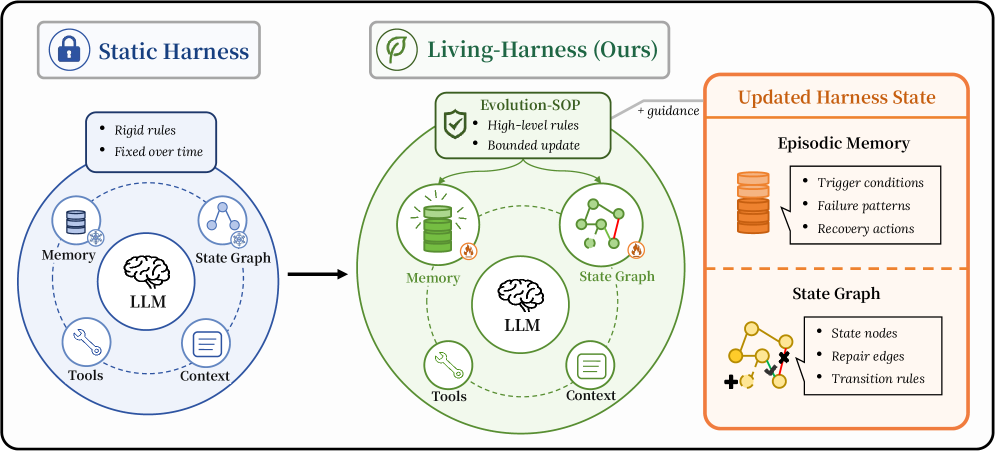

图 1：静态框架 vs. 自进化框架。静态框架在部署后保持固定。Living-Harness 使用 Evolution-SOP 指导对片段记忆和状态图的有界更新，供未来检索使用，而工具和基础上下文保持冻结。

现有方法从两个方向解决了这个问题的部分内容。框架设计和工作流优化方法构建更强的提示、SOP、工具约束、技能或执行结构，使智能体保持在预定义路径内 [^19] [^13] [^44] [^37] [^49]。它们展示了外部程序结构的价值，但生成的框架通常在部署前设计或优化，然后作为固定工件复用。反思和经验记忆方法则保留批评、摘要或成功和失败的轨迹，供后续尝试使用 [^27] [^50] [^22]。这些方法提供了有用的经验，但诸如"将用户转接给人工"这样的文本化教训本身并不能指定触发条件、所需工具动作以及在未来回合中防止相同失败所需的工作流转换。因此，缺失的能力不仅是反馈收集本身，而是**持久程序性修复**：将基于评估器的失败证据转换为可复用的关系——何时发生失败、缺少或需要什么动作或转换、以及后续推演（Rollout）应如何恢复。

有用的程序性修复机制必须满足几个要求。首先，更新应基于完成的轨迹及其评估信号，而非仅基于未经验证的自我批评。其次，修复必须在回合间持久存在，同时保持对相关任务族或失败条件的范围限定。第三，适应应仅修改框架的有状态部分，保持可用工具和基础上下文冻结，使累积的经验不会随意重写智能体的操作边界。最后，持久状态应捕获两种互补的知识形式：关于为何发生失败以及如何恢复的**经验性知识**，以及关于应引入或修订哪个状态条件化动作或转换的**工作流知识**。这些要求促使我们构建由互补的片段记忆和状态图结构组成的进化框架状态。

因此，我们提出 Living-Harness，一个自进化的框架，它将经过评估的交互轨迹转换为持久的程序性修复。如图 1 所示，工具和基础上下文保持冻结，而片段记忆和状态图不断进化。每个回合结束后，评估器对完成的交互提供反馈，领域级 Evolution-SOP 指导如何解释失败以及哪些修复被提交到框架状态。片段记忆记录触发条件、失败模式和恢复动作，而状态图记录状态节点、修复边和转换规则。在未来回合中，相关的记忆和图条目被检索为程序性上下文，使重复出现的失败能够逐步改善后续交互。

为了形式化这种跨回合适应，我们将智能体视为在不确定性下进行推理，不仅关于环境，还关于未来决策可用的程序性知识。这种程序状态 POMDP（部分可观测马尔可夫决策过程，Partially Observable Markov Decision Process）视角区分了回合内执行和回合后框架修订，并促使我们形成推演-评估-更新（Rollout–Evaluate–Update）的表述。

本文的主要贡献总结如下：

- **交互式智能体的持久程序性修复**。我们识别了任务局部修正（Task-local correction）与跨回合适应之间的差距：反馈可能改善单次重试，但不会将可复用的修复安装到指导后续交互的框架中。我们将适应目标形式化为基于评估器的程序性修复，这些修复在观察到失败的回合之后持续存在。

- **Living-Harness 框架**。我们引入了一个推演-评估-更新框架，其中领域级 Evolution-SOP 将完成的轨迹和评估信号转换为片段记忆和状态图的有界更新（Bounded update）。这些组件存储互补的经验性和工作流知识，被检索以指导未来回合，并在工具和基础上下文保持冻结的情况下进化。我们进一步提供了这一跨回合更新过程的程序状态 POMDP 解释。

- **恢复累积和框架复用的评估**。我们在从 $\tau^{2}$-Bench 和 MultiWOZ-2.4 派生的八个交互式环境（Interactive environment）中评估 Living-Harness。它将平均 Pass@1 相比最强交互基线分别提高了 10.07 和 9.91 个百分点，同时展现了周期性恢复累积以及跨模型骨干仅通过检索方式复用进化框架状态的能力。

## 相关工作

**交互式 LLM 智能体**。关于交互式 LLM 智能体的研究探讨语言模型如何通过对观察、用户反馈、工具输出和任务约束进行条件化，在多轮交互中采取行动，而非产生孤立的一次性响应。任务导向对话基准提供了这一设定的早期形式化，要求智能体维护对话状态、遵循领域策略并完成用户目标，如 MultiWOZ [^4] [^45] 和 Schema-Guided Dialogue [^25] 所形式化；最近的工具-智能体-用户基准将其扩展到需要工具使用和策略遵从的现实领域 [^42]。LLM 智能体将这一方向扩展到推理、工具使用、协调和试验级适应，如关于基于 LLM 的自主智能体的最新综述所总结 [^32] [^35]。代表性系统包括用于基于浏览的问答的 WebGPT [^20]、用于推理-动作交织的 ReAct [^43]、用于 API 使用的 Toolformer [^26] 和 ToolLLM [^24]、用于多智能体协调的 AutoGen [^34]，以及用于基于反馈的重试的 Reflexion [^27]。这些方法在交互或重试内改善行为，而 Living-Harness 将回合后证据转化为未来回合的持久程序性修复。

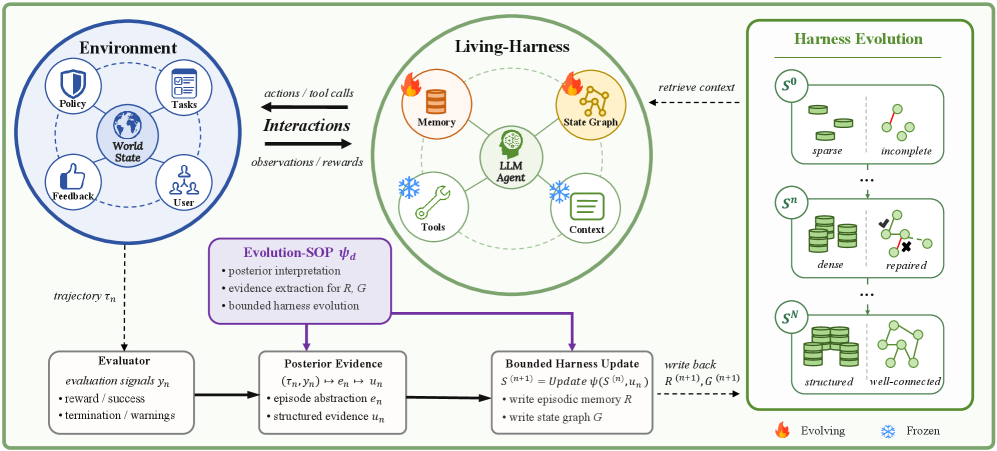

图 2：Living-Harness 概览。在回合 n 中，智能体在框架状态 $S^{(n)}$ 下与环境交互，产生轨迹 $\tau_{n}$ 和评估信号 $y_{n}$。在 Evolution-SOP $\psi_{d}$ 的指导下，这些信号被转换为后验证据并用于更新片段记忆 $\mathcal{R}$ 和状态图 $G$。生成的状态 $S^{(n+1)}$ 被写回并检索以指导未来回合，而工具和基础上下文保持冻结。

**智能体框架**。随着 LLM 智能体从孤立的提示到工具使用、记忆、评估和多步骤执行的演进，它们的行为越来越多地受到围绕模型的外部程序的塑造。我们使用**智能体框架**来表示这一控制层，它将提示、工具、记忆、工作流、执行循环、约束、跟踪和评估接口外部化 [^19] [^13]。关于智能体评估 [^12]、上下文工程 [^46]、元工具 [^1]、工作流优化 [^10] [^49]、护栏、会话、跟踪和技能 [^14] [^15] [^39] [^18] 基准的研究进一步表明，这种周围结构强烈影响实际可靠性。技能（Skill）是核心的框架级抽象，因为它们将程序性知识打包成可复用、可调用的单元，包括指令、代码、资源、适用条件和接口，可以在推理时加载或选择 [^38] [^11] [^17] [^29]。现有的框架和技能系统提供可复用的程序结构，但通常在部署前指定或优化。Living-Harness 则从经过评估的回合后证据更新其片段记忆和状态图，同时保持工具和基础上下文固定。

**自进化智能体系统**。自进化智能体系统将交互经验转换为持久工件，如记忆、提示、技能、工作流、策略或架构 [^7] [^6] [^16]。反思 [^27] 和推理记忆方法 [^50] [^22] 将反馈或轨迹存储为可复用的教训或可检索的记忆；以技能为中心的系统获取、路由或进化可复用能力 [^2]，从开放式技能库 [^29] 到层次化技能库 [^36]、进化记忆技能 [^48] 和技能转移路由器 [^30]；工作流、架构和环境进化方法优化更高级别的执行结构，如代码表示的工作流 [^49]、模块化工具使用策略 [^41]、多智能体架构 [^47]、合成环境 [^5] 和测试时程序性策略 [^31]。这些方法通常进化特定工件，如记忆、技能、策略、工作流或架构。Living-Harness 则将经过评估的失败转换为持久框架状态内片段记忆和工作流结构的协调更新。

## 方法

本节介绍 Living-Harness，一个通过推演-评估-更新循环累积持久程序性修复的自进化智能体框架。如图 2 所示，智能体从当前框架状态检索相关条目，并在固定工具和基础上下文下与环境交互。回合评估后，Evolution-SOP 将完成的交互及其评估信号转换为结构化证据，用于更新片段记忆和状态图。更新后的状态被写回以在后续回合中检索，使程序性修复能够跨交互累积。

### 问题设定与框架状态

我们考虑一个 LLM 智能体在领域 $d$ 中操作，经历一系列交互回合。在回合 $n$ 中，智能体接收任务 $x_{n}$，与环境交互，并产生由观察、响应和工具动作组成的轨迹 $\tau_{n}$。交互终止后，评估器产生描述其执行结果的信号 $y_{n}$。目标是使用 $(\tau_{n},y_{n})$ 改善后续回合可用的程序性指导。

Living-Harness 将固定的执行资源与进化的程序状态分离。在回合 $n$，框架表示为

$$
H_{d}^{(n)}=\left(C_{d}^{\mathrm{act}},\psi_{d},S_{d}^{(n)}\right),\qquad S_{d}^{(n)}=\left(\mathcal{R}_{d}^{(n)},G_{d}^{(n)}\right).
$$

这里，$C_{d}^{\mathrm{act}}$ 包含执行器可用的工具、基础上下文和领域规则；$\psi_{d}$ 是管理回合后更新的固定 Evolution-SOP；$S_{d}^{(n)}$ 是进化的框架状态。状态在当前回合内保持固定，仅在完成的交互经过评估后才可能被修订。因此，Living-Harness 既不更新基础模型也不更新 $C_{d}^{\mathrm{act}}$；其适应目标是 $S_{d}^{(n)}$。

进化状态包含两种互补的程序性知识形式。片段记忆 $\mathcal{R}_{d}^{(n)}$ 存储范围化的触发条件、失败模式和恢复动作记录。状态图 $G_{d}^{(n)}$ 存储状态节点、转换规则和将观察到的条件连接到缺失或修订动作的修复边。在后续回合中，从两个组件检索相关条目并呈现为程序性上下文，而 $C_{d}^{\mathrm{act}}$ 中的固定规则保持优先级。

从概念上讲，$S_{d}^{(n)}$ 诱导出回合级程序状态 $z^{(n)}$：环境在回合内演化，而 $z^{(n)}$ 中的程序性信息仅通过回合后框架更新改变。这种双时间尺度视图在程序状态形式化中得到形式化。

**初始化**。初始状态不包含片段记忆，仅包含粗粒度图脚手架：

$$
S_{d}^{(0)}=\left(\emptyset,G_{d,\mathrm{scaf}}\right).
$$

脚手架提供领域根节点和任务族结构，但不包含细粒度失败修复。此类修复通过 Evolution-SOP 从经过评估的交互经验中诱导得出。

<table><tbody><tr><td></td><td colspan="4">$\tau^{2}$-Bench</td><td colspan="4">MultiWOZ-2.4</td></tr><tr><td>模型</td><td>Retail</td><td>Airline</td><td>Telecom</td><td>平均</td><td>1-Domain</td><td>2-Domains</td><td>3-Domains</td><td>平均</td></tr><tr><td colspan="9">旗舰模型</td></tr><tr><td>Gemini 3 Pro</td><td>75.88</td><td>80.50</td><td>91.01</td><td>82.92</td><td>79.20</td><td>54.52</td><td>24.48</td><td>55.80</td></tr><tr><td>GLM-5</td><td>73.68</td><td>82.50</td><td>86.84</td><td>80.66</td><td>46.02</td><td>21.24</td><td>0.00</td><td>23.80</td></tr><tr><td>Qwen3-max</td><td>72.20</td><td>59.50</td><td>84.20</td><td>74.85</td><td>37.17</td><td>35.97</td><td>0.00</td><td>31.10</td></tr><tr><td>GPT-5.2</td><td>57.02</td><td>70.00</td><td>52.23</td><td>57.39</td><td>48.23</td><td>37.88</td><td>7.69</td><td>35.90</td></tr><tr><td>Kimi-k2</td><td>70.60</td><td>56.50</td><td>65.80</td><td>66.11</td><td>54.88</td><td>41.56</td><td>0.00</td><td>38.63</td></tr><tr><td colspan="9">交互基线（GPT-5.2）</td></tr><tr><td>ReAct</td><td>52.63</td><td>66.00</td><td>53.86</td><td>55.54</td><td>70.35</td><td>19.18</td><td>9.09</td><td>29.30</td></tr><tr><td>Reflexion</td><td>78.07</td><td>80.00</td><td>64.91</td><td>73.02</td><td>77.88</td><td>51.35</td><td>21.68</td><td>53.10</td></tr><tr><td>AWM</td><td>56.14</td><td>66.00</td><td>39.47</td><td>51.08</td><td>67.26</td><td>40.57</td><td>13.99</td><td>42.80</td></tr><tr><td>ReasoningBank</td><td>59.65</td><td>70.00</td><td>37.72</td><td>52.52</td><td>77.27</td><td>58.33</td><td>7.50</td><td>55.59</td></tr><tr><td>EvoTest</td><td>57.31</td><td>64.00</td><td>38.07</td><td>50.62</td><td>62.39</td><td>34.86</td><td>11.89</td><td>37.80</td></tr><tr><td colspan="9">我们的方法（GPT-5.2）</td></tr><tr><td>Living-Harness</td><td>85.96</td><td>88.00</td><td>78.07</td><td>83.09</td><td>76.55</td><td>70.52</td><td>25.87</td><td>65.50</td></tr></tbody></table>

表 1：$\tau^{2}$-Bench 和 MultiWOZ-2.4 上的主要结果。所有值为 Pass@1（%）。平均值按评估任务数量加权。**粗体**和<u>下划线</u>值分别表示最佳和次佳结果。

### 用于程序性修复的 Evolution-SOP

Evolution-SOP $\psi_{d}$ 是一个固定的领域级协议，管理经过评估的交互如何修订进化的框架状态。它在推演之后运行，而非作为执行器任务执行提示的一部分。跨领域，Living-Harness 使用相同的后验-提取-提交程序，而 $\psi_{d}$ 提供特定于领域的指导，用于解释失败、分配更新范围和遵守领域和工具约束。

给定任务 $x_{n}$、其完成的轨迹 $\tau_{n}$、评估器信号 $y_{n}$ 和固定执行资源 $C_{d}^{\mathrm{act}}$，Evolution-SOP 首先产生回合抽象：

$$
e_{n}=\operatorname{Post}_{M,\psi_{d}}\left(x_{n},\tau_{n},y_{n},C_{d}^{\mathrm{act}}\right).
$$

抽象识别任务目标、经验证的交互事实、执行结果以及关键失败或恢复点。它不是保留完整轨迹，而是隔离在当前回合结束后可能仍然有用的程序性信息。

然后将回合抽象转换为框架状态两个组件的证据：

$$
u_{n}=\left(u_{n}^{\mathcal{R}},u_{n}^{G}\right)=\operatorname{Extract}_{\psi_{d}}(e_{n}).
$$

这里，$u_{n}^{\mathcal{R}}$ 捕获片段记忆的触发条件、失败模式和恢复动作，而 $u_{n}^{G}$ 捕获状态图的相应状态、动作和转换。因此，记忆保留为什么以及在什么条件下修复有用，而图记录该修复在何处改变未来程序。

提取的证据被视为候选修复。在提交之前，会检查其证据支持、任务范围以及与固定领域和工具约束的一致性。被接受的候选创建或强化记忆条目和状态条件化修复边；不受支持或冲突的候选使持久状态保持不变。

### 推演-评估-更新循环

在回合 $n$，Living-Harness 从当前任务 $x_{n}$ 及其范围 $f_{n}$ 构建任务条件化查询：

$$
q_{n}=Q(x_{n},f_{n}).
$$

从当前片段记忆和状态图检索相关条目，并呈现为面向执行器的程序性上下文：

$$
\kappa_{n}=\operatorname{Render}\!\left(\operatorname{Retrieve}_{\mathcal{R}}(\mathcal{R}^{(n)},q_{n}),\operatorname{Retrieve}_{G}(G^{(n)},q_{n})\right).
$$

这种选择性投影暴露与当前任务最相关的程序性知识，而非重放完整交互历史。智能体然后使用固定执行资源和检索的上下文与环境交互：

$$
\tau_{n}\sim p_{M}\!\left(\tau\mid x_{n},C_{d}^{\mathrm{act}},\kappa_{n}\right).
$$

框架状态在整个推演过程中保持固定。

交互完成后，评估器产生

$$
y_{n}=E(x_{n},\tau_{n}).
$$

Evolution-SOP 将 $\tau_{n}$ 和 $y_{n}$ 转换为上面定义的回合抽象 $e_{n}$ 和候选修复证据 $u_{n}$。然后将接受的证据写入持久框架状态：

$$
S^{(n+1)}=\operatorname{Update}_{\psi_{d}}\left(S^{(n)},u_{n};C_{d}^{\mathrm{act}}\right).
$$

记忆更新保留可复用的失败-恢复经验，而图更新修订相应的程序性转换。如果没有候选修复被接受，状态保持不变。否则，更新的状态仅对后续交互可用，完成推演-评估-更新循环，而不允许回合后证据改变产生它的推演。

**任务局部修正与持久进化**。对于允许重试的任务，失败的尝试可能产生仅在当前任务实例内使用的局部反思。此类任务局部反馈在实例结束时被丢弃。持久进化则将基于评估器的修复提交到片段记忆和状态图，使其对后续任务实例可用。

### 程序状态分析

我们通过部分可观测马尔可夫决策过程（POMDP）视角分析 Living-Harness。在标准 POMDP 中，环境状态不能直接观察到，必须从交互历史中推断。Living-Harness 用表示从进化框架中可用的程序性信息的回合级程序状态增强了这一视图。

**定义 1（环境状态信念）**。令 $s_{t}\in\mathcal{S}$ 表示交互步骤 $t$ 的环境状态，令 $h_{t}=(o_{\leq t},a_{<t})$ 表示交互历史。关于环境的标准 POMDP 信念为

$$
b_{t}(s)=P\!\left(s_{t}=s\mid h_{t}\right).
$$

**定义 2（程序增强信念）**。使用当前框架状态 $S^{(n)}$ 诱导的程序状态 $z^{(n)}$，我们增强环境状态并定义相应的联合信念为

$$
\widetilde{s}_{t}^{(n)}=\left(s_{t},z^{(n)}\right),\quad B_{t}^{(n)}(s,z)=P\!\left(s_{t}=s,z^{(n)}=z\mid h_{t}\right).
$$

通过边际化恢复仅环境信念，$b_{t}(s)=\sum_{z}B_{t}^{(n)}(s,z)$。

两个状态在不同时间尺度上演化。在回合 $n$ 期间，$z^{(n)}$ 保持固定，而联合信念更新为

$$
B_{t+1}^{(n)}(s^{\prime},z)\propto\Omega(o_{t+1}\mid s^{\prime})\sum_{s}T(s^{\prime}\mid s,a_{t},z)B_{t}^{(n)}(s,z).
$$

评估后，对片段记忆和状态图的更新为后续回合诱导新的程序状态。因此，$t$ 索引回合内推理，而 $n$ 索引跨回合框架进化。

**命题 1（信息细化）**。对于嵌套信息集 $\mathcal{I}_{s}=\sigma(h_{t})\subseteq\mathcal{I}_{s,z}=\sigma(h_{t},z^{(n)})$，考虑执行相关潜变量 $\xi\in L^{2}$。定义 $\mathcal{B}(\mathcal{I})=\mathbb{E}[\operatorname{Var}(\xi\mid\mathcal{I})]$。则 $\mathcal{B}(\mathcal{I}_{s,z})=\mathcal{B}(\mathcal{I}_{s})-\Gamma_{z}\leq\mathcal{B}(\mathcal{I}_{s})$，其中 $\Gamma_{z}=\mathbb{E}[\operatorname{Var}(\mathbb{E}[\xi\mid\mathcal{I}_{s,z}]\mid\mathcal{I}_{s})]\geq 0$。当 $z$ 包含关于 $\xi$ 的非零条件信息时，不等式严格成立。

这里，$\mathcal{B}(\mathcal{I})$ 表示信息 $\mathcal{I}$ 下的贝叶斯误差界，而 $\mathcal{I}_{s,z}$ 用 $z^{(n)}$ 表示的检索的记忆和图上下文增强交互历史。因此，命题 1 表明，信息性程序上下文可以相对于单独的交互历史减少最优预测误差。

## 实验

<table><tbody><tr><td rowspan="2">周期</td><td colspan="3">$\tau^{2}$-Bench</td><td colspan="5">MultiWOZ-2.4</td></tr><tr><td>Retail</td><td>Airline</td><td>Telecom</td><td>Restaurant</td><td>Hotel</td><td>Train</td><td>Attraction</td><td>Taxi</td></tr><tr><td>0</td><td>57.02 (+0.00)</td><td>70.00 (+0.00)</td><td>57.39 (+0.00)</td><td>30.89 (+0.00)</td><td>24.11 (+0.00)</td><td>43.43 (+0.00)</td><td>40.15 (+0.00)</td><td>8.21 (+0.00)</td></tr><tr><td>1</td><td>74.56 (+17.54)</td><td>76.00 (+6.00)</td><td>67.54 (+10.15)</td><td>43.47 (+12.58)</td><td>42.64 (+18.53)</td><td>64.65 (+21.22)</td><td>61.36 (+21.21)</td><td>28.72 (+20.51)</td></tr><tr><td>2</td><td>79.82 (+5.26)</td><td>88.00 (+12.00)</td><td>71.92 (+4.38)</td><td>41.65 (-1.82)</td><td>46.95 (+4.31)</td><td>65.86 (+1.21)</td><td>63.89 (+2.53)</td><td>36.41 (+7.69)</td></tr><tr><td>3</td><td>85.96 (+6.14)</td><td>86.00 (-2.00)</td><td>78.07 (+6.15)</td><td>44.85 (+3.20)</td><td>48.22 (+1.27)</td><td>66.26 (+0.40)</td><td>65.40 (+1.51)</td><td>36.92 (+0.51)</td></tr></tbody></table>

表 2：Living-Harness 的周期性能。括号内值报告与前一周期的绝对变化。Rest. 和 Attr. 分别表示 Restaurant 和 Attraction。**粗体**和<u>下划线</u>值分别表示每个领域内最佳和次佳周期性能。

### 实验设置

**评估基准**。我们在两个交互式基准上评估 Living-Harness：

- **$\tau^{2}$-Bench** [^3]：一个用于对话智能体的现实基准，具有多轮交互、策略约束和可执行工具使用。我们使用三个领域：Retail、Airline 和 Telecom。
- **MultiWOZ-2.4** [^45]：一个修正的多领域任务导向对话基准。我们使用五个主要领域：Restaurant、Hotel、Train、Attraction 和 Taxi。

在两个基准中，我们报告任务成功率，记为 Pass@1，作为主要指标。

**基线**。我们将 Living-Harness 与两组基线进行比较：

- **旗舰模型**：我们评估强大的专有和开放权重骨干，包括 GPT-5.2 [^21]、Gemini 3 Pro [^23]、GLM-5 [^8]、Qwen3-max [^40] 和 Kimi-k2 [^28]。这些模型在没有在线框架进化的情况下评估，以衡量每个智能体骨干的基础能力。
- **交互基线**：我们与代表性的交互式和自改进智能体方法进行比较，包括 ReAct [^43]、Reflexion [^27]、Agent Workflow Memory (AWM) [^33]、ReasoningBank [^22] 和 EvoTest [^9]。

**实现细节**。所有基于 GPT-5.2 的交互方法，包括 Living-Harness，使用具有中等推理努力的 GPT-5.2 作为骨干；在 Living-Harness 内，执行器和所有自进化模块共享相同的骨干。对于 $\tau^{2}$-Bench，模拟用户使用 GPT-5.1 实现。在执行器和所有进化模块中，我们使用采样温度 $0.2$ 并设置核采样为 $\texttt{top\_p}=1.0$。在适用情况下，所有交互基线使用相同的工具接口、评估器和任务级重试预算。我们启用任务局部反思，每个任务最多 3 次尝试；此局部缓冲区仅在当前实例内使用，永远不会直接写入全局片段记忆 $\mathcal{R}^{(n)}$ 或状态图 $G^{(n)}$。记忆和图检索都使用 top-$k=3$。

### 主要结果

**显著的整体增益**。表 1 显示 Living-Harness 在两个基准上都取得了最佳整体性能，在 $\tau^{2}$-Bench 上达到 83.09 平均 Pass@1，在 MultiWOZ-2.4 上达到 65.50。在 $\tau^{2}$-Bench 上，它略微超过最强旗舰模型平均值 Gemini 3 Pro 的 82.92，尽管使用 GPT-5.2 medium 作为基础模型。它还大幅改善了基于 GPT-5.2 的交互基线：与最强 $\tau^{2}$-Bench 交互基线 Reflexion 相比，Living-Harness 将平均值从 73.02 提高到 83.09。在 MultiWOZ-2.4 上，它比最强交互基线平均值 ReasoningBank 的 55.59 提高了近 10 个百分点，并比 Reflexion 高出 12.40 个百分点。尽管其单领域得分略低于 Reflexion，Living-Harness 在双领域和三领域组中取得了最佳得分，表明当程序性修复必须跨领域边界转移时具有更强的优势。这些结果支持我们的主张：有界框架状态更新提供了超越更强单步推理或任务局部反思的增益。

**一致的自进化**。表 2 进一步检验了 Living-Harness 的自进化动态。在 $\tau^{2}$-Bench 上，所有三个领域相比周期 0 都有显著改善：Retail 从 57.02 上升到 85.96，Telecom 从 57.39 上升到 78.07，Airline 在周期 2 达到 88.00，在周期 3 保持在 86.00 的高位。MultiWOZ-2.4 显示类似的强劲增长，最终周期改善在 Restaurant 上 $+13.96$，Hotel 上 $+24.11$，Train 上 $+22.83$，Attraction 上 $+25.25$，Taxi 上 $+28.71$。最大增益通常出现在第一个进化周期之后，而后续周期产生较小的改进和偶尔的轻微波动。这种模式与有界程序进化一致：早期更新修复缺失的工作流步骤，后续周期改进累积的框架状态，而不是简单地添加更多上下文。

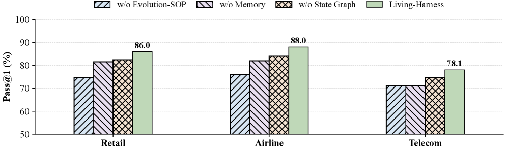

图 3：$\tau^{2}$-Bench 上的组件消融：移除 Evolution-SOP 导致最大下降，而记忆和状态图消融显示互补贡献。

| 模型 | Rest. | Hotel | Train | Attr. | Taxi |
| --- | --- | --- | --- | --- | --- |
| Gemini 3 Pro | 47.83 | 45.18 | 55.35 | 63.64 | 30.26 |
| + Living-Harness | **66.13** | **63.71** | **66.87** | **66.67** | **68.72** |
| GLM-5 | 24.94 | 16.50 | 18.18 | 27.27 | 0.00 |
| + Living-Harness | **39.36** | **38.83** | **38.38** | **38.13** | **43.08** |
| Qwen3-max | 19.45 | 31.98 | 37.98 | 35.10 | 0.00 |
| + Living-Harness | **45.77** | **44.42** | **47.27** | **44.70** | **45.13** |
| Kimi-k2 | 40.27 | 35.37 | 38.42 | 37.01 | 0.00 |
| + Living-Harness | **44.85** | **43.65** | **47.27** | **47.22** | **45.13** |

表 3：MultiWOZ-2.4 上冻结 Living-Harness 状态的仅检索跨模型迁移。**粗体**值表示使用迁移的框架状态获得的得分。Rest. 和 Attr. 分别表示 Restaurant 和 Attraction。

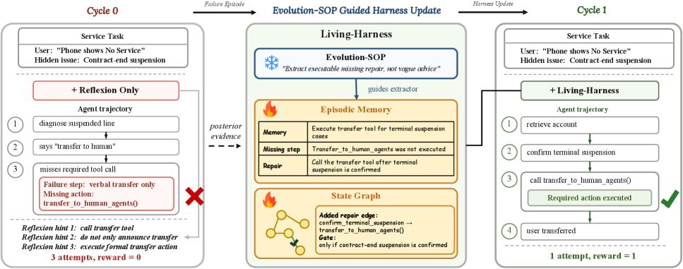

图 4：持久程序性修复的案例研究。在周期 0，Reflexion 认识到应该转接用户，但反复遗漏所需的 transfer_to_human_agents() 调用。在 Evolution-SOP 的指导下，Living-Harness 将这个经过评估的失败转换为片段记忆条目和状态图修复边。在周期 1，修复后的框架检索缺失的程序，执行工具调用，并在一次尝试中完成任务。

---

**译者注**：

- **Living-Harness** 是本文提出的核心框架名称，保持原文以强调其作为专有名词的地位。其核心思想是将智能体框架从静态（部署后固定）转变为动态进化的系统。
- **片段记忆（Episodic Memory）** 和 **状态图（State Graph）** 是框架中两种互补的知识表示形式，前者存储经验性知识（为什么失败、如何恢复），后者存储工作流知识（在哪里修改程序）。
- **Evolution-SOP** 是领域级的进化标准操作程序，是指导框架状态更新的固定协议。
- **Pass@1** 在本文中指首次尝试的任务成功率，是衡量智能体性能的核心指标。
- 本文的关键创新在于将**任务局部修正**（仅在单次任务内有效的反馈）转化为**持久程序性修复**（可跨回合复用的程序性知识更新）。

### 消融研究

消融定义。在 w/o Evolution-SOP 中，我们保留记忆和状态图容器，但将领域更新过程替换为通用提取器，禁用领域特定的提交门控和任务家族范围的更新规则。在 w/o Memory 中，片段记忆检索和记忆更新被禁用。在 w/o State Graph 中，图检索和更新被禁用。

组件消融。图 3 显示所有组件都对 Living-Harness 的最终性能有贡献。移除 Evolution-SOP 导致最大的性能下降，平均分数从 83.09 降至 73.38，表明性能提升并非仅仅来自附加记忆或工作流图，而是来自结构化的后验解释和有界状态演化。移除记忆或状态图也会降低性能，平均分数分别为 77.34 和 79.50，表明可复用的恢复经验和结构化工作流转换提供了互补的收益。完整的 Living-Harness 在每个领域都取得了最佳结果，表明完整系统提供的收益并不局限于单一领域。

### 深入分析

框架迁移。表 3 评估了使用 GPT-5.2 在源交互流上演化的 Living-Harness 状态是否可以被冻结并迁移到其他骨干模型。在目标模型评估期间，迁移的骨干模型仅从冻结的片段记忆和状态图中检索，不进行额外的全局更新。在 Gemini 3 Pro、GLM-5、Qwen3-max 和 Kimi-k2 上，冻结的框架改进了每个报告的领域分数。在基础模型表现困难的领域，收益尤其显著，例如在 Taxi 领域，GLM-5、Qwen3-max 和 Kimi-k2 分别从 0.00 提升至 43.08、45.13 和 45.13。重要的是，该框架也改进了更强的骨干模型，如 Gemini 3 Pro，表明学习到的状态不仅对较弱的模型有用。相反，记忆和状态图编码了可复用的框架级程序性知识，不同的执行者可以检索和利用。

可执行修复：案例研究。图 4 展示了检索到的修复如何改变后续的智能体行为。在失败循环中，Reflexion 反复识别出正确的高层经验教训：智能体应将用户转接给人工客服，但推演仍然失败，因为所需的工具调用从未被执行。Living-Harness 将此失败转化为可执行修复：缺失的动作既被存储为片段记忆，又作为状态图边连接终端挂起检测到 transfer\_to\_human\_agents()。检索到的修复不是模糊的建议，而是状态条件化的修复，指导所需的转接动作。这说明了与响应级反思的关键区别：重复出现的失败变成可检索的修复，塑造未来的推演。

## 结论

我们提出了 Living-Harness，一个框架状态演化框架，它将重复出现的交互失败转化为外部可执行程序状态的有界更新。Living-Harness 不是将失败视为用于响应级修正的孤立轨迹，而是将它们作为修订片段记忆和工作流结构的证据，从而指导未来的推演。这将交互式智能体适应从仅改进下一个响应转变为维护模型周围持久的、可检索的程序。在 $\tau^{2}$ -Bench 和 MultiWOZ-2.4 上的实验显示了改进的任务性能、跨循环的恢复积累以及跨模型骨干的仅检索复用。这些结果表明，可靠的智能体不需要仅依赖更强的单步生成或模型端更新；它们也可以通过演化组织未来交互的有界框架状态来改进。更广泛地说，Living-Harness 指向这样的智能体系统：不仅学习接下来回答什么，还学习如何在保持先验、结构和约束的基础上程序化地处理未来任务。

## 参考文献

Living-Harness Is an Interactive-Agent Evolver 的补充材料

摘要。本补充文档为主论文提供了形式化证明、扩展的可重现性细节、额外的框架状态分析、提示规范以及局限性的扩展讨论。主论文是自包含的；以下材料提供了支撑性技术细节和扩展结果。

## 附录 A 程序状态信念紧缩的证明

本节给出了主论文中命题 1 的形式化陈述和证明。该结果为表示执行引导的程序性状态 $z$ 提供了信息论上的理由：添加一个信息丰富的状态变量可以精化可用信息，因此不会增加最优贝叶斯估计误差。它并不声称 $z$ 的每个近似实现都必须严格改进性能；严格改进要求 $z$ 包含关于执行相关潜变量的非零条件信息。

#### 设定。

令 $(\Omega,\mathcal{F},\mathbb{P})$ 为一个概率空间。令 $\xi\in L^{2}(\Omega)$ 表示一个执行相关的潜变量，例如有效的工作流分支、隐藏的失败模式或下一个可恢复状态。令 $\mathcal{I}_{s}\subseteq\mathcal{F}$ 表示仅环境信念可用的信息，令 $\mathcal{I}_{s,z}\subseteq\mathcal{F}$ 表示在额外建模程序性状态 $z$ 后可用的精化信息。我们假设自然的信息嵌套条件

$$
\mathcal{I}_{s}\subseteq\mathcal{I}_{s,z},
$$

这意味着增强的信念可以忽略 $z$ 并恢复仅环境信念。

#### 形式化陈述。

对于任何信息集 $\mathcal{I}$，定义贝叶斯均方误差界

$$
\mathcal{B}(\mathcal{I}):=\inf_{\widehat{\xi}\in L^{2}(\mathcal{I})}\mathbb{E}\!\left[(\xi-\widehat{\xi})^{2}\right],
$$

其中 $L^{2}(\mathcal{I})$ 是平方可积的 $\mathcal{I}$-可测估计量的集合。

命题 A.1（命题 1 的形式化版本）。在上述设定下，仅环境和程序增强的贝叶斯误差界满足

$$
\mathcal{B}(\mathcal{I}_{s,z})=\mathcal{B}(\mathcal{I}_{s})-\Gamma_{z}\leq\mathcal{B}(\mathcal{I}_{s}),
$$

其中

$$
\Gamma_{z}=\mathbb{E}\!\left[\operatorname{Var}\!\left(\mathbb{E}[\xi\mid\mathcal{I}_{s,z}]\mid\mathcal{I}_{s}\right)\right]\geq 0.
$$

此外，当 $\Gamma_{z}>0$ 时不等式是严格的，等价于精化的后验均值 $\mathbb{E}[\xi\mid\mathcal{I}_{s,z}]$ 不是 $\mathcal{I}_{s}$-可测的。

#### 证明。

对于任何信息集 $\mathcal{I}$，平方损失下的贝叶斯估计量是条件期望 $\mu_{\mathcal{I}}=\mathbb{E}[\xi\mid\mathcal{I}]$。因此，

$$
\mathcal{B}(\mathcal{I})=\mathbb{E}\!\left[(\xi-\mu_{\mathcal{I}})^{2}\right]=\mathbb{E}\!\left[\operatorname{Var}(\xi\mid\mathcal{I})\right].
$$

由于 $\mathcal{I}_{s}\subseteq\mathcal{I}_{s,z}$，条件方差分解给出

$$
\displaystyle\operatorname{Var}(\xi\mid\mathcal{I}_{s})
$$

$$
\displaystyle=\mathbb{E}\!\left[\operatorname{Var}(\xi\mid\mathcal{I}_{s,z})\mid\mathcal{I}_{s}\right]
$$

$$
\displaystyle\quad+\operatorname{Var}\!\left(\mathbb{E}[\xi\mid\mathcal{I}_{s,z}]\mid\mathcal{I}_{s}\right).
$$

两边取期望得到

$$
\mathcal{B}(\mathcal{I}_{s})=\mathcal{B}(\mathcal{I}_{s,z})+\Gamma_{z}.
$$

重排得

$$
\mathcal{B}(\mathcal{I}_{s,z})=\mathcal{B}(\mathcal{I}_{s})-\Gamma_{z}\leq\mathcal{B}(\mathcal{I}_{s}),
$$

因为 $\Gamma_{z}\geq 0$。不等式严格成立当且仅当 $\Gamma_{z}>0$。由于条件方差为零当且仅当被条件化的随机变量相对于条件 σ-代数可测，$\Gamma_{z}>0$ 成立当 $\mathbb{E}[\xi\mid\mathcal{I}_{s,z}]$ 尚未由 $\mathcal{I}_{s}$ 确定时。证毕。

#### 近似实现。

该命题涉及精化信息集下的最优贝叶斯估计量。Living-Harness 通过检索的程序性上下文、后验抽象和有界状态更新来近似实现此精化。

令 $\widetilde{\mu}_{s,z}$ 为一个 $\mathcal{I}_{s,z}$-可测估计量，满足

$$
\mathbb{E}\!\left[(\widetilde{\mu}_{s,z}-\mu_{\mathcal{I}_{s,z}})^{2}\right]\leq\epsilon_{z}.
$$

则

$$
\mathbb{E}\!\left[(\xi-\widetilde{\mu}_{s,z})^{2}\right]\leq\mathcal{B}(\mathcal{I}_{s})-\Gamma_{z}+\epsilon_{z}.
$$

#### 证明。

由于 $\widetilde{\mu}_{s,z}-\mu_{\mathcal{I}_{s,z}}$ 是 $\mathcal{I}_{s,z}$-可测的，且 $\mathbb{E}[\xi-\mu_{\mathcal{I}_{s,z}}\mid\mathcal{I}_{s,z}]=0$，交叉项消失：

$$
\displaystyle\mathbb{E}\!\left[(\xi-\widetilde{\mu}_{s,z})^{2}\right]
$$

$$
\displaystyle=\mathbb{E}\!\left[(\xi-\mu_{\mathcal{I}_{s,z}})^{2}\right]
$$

$$
\displaystyle\quad+\mathbb{E}\!\left[(\widetilde{\mu}_{s,z}-\mu_{\mathcal{I}_{s,z}})^{2}\right]
$$

$$
\displaystyle\leq\mathcal{B}(\mathcal{I}_{s,z})+\epsilon_{z}
$$

$$
\displaystyle=\mathcal{B}(\mathcal{I}_{s})-\Gamma_{z}+\epsilon_{z}.
$$

因此，当 $\epsilon_{z}<\Gamma_{z}$ 时，近似增强估计量的上界低于仅环境贝叶斯界。更一般地，相对于具有超额误差 $\epsilon_{s}$ 的近似仅环境估计量，增强上界更低当

$$
\epsilon_{z}-\epsilon_{s}<\Gamma_{z}.
$$

该条件表明 $z$ 贡献的信息增益必须超过表示和使用它引入的额外近似误差。

#### 决策风险版本。

相同的单调性对一般决策风险也成立。令 $\mathcal{A}$ 为动作空间，令 $\ell(a,\xi)$ 为当执行相关潜变量为 $\xi$ 时采取动作 $a$ 所产生的损失。对于信息集 $\mathcal{I}$，令 $\Pi(\mathcal{I})$ 表示所有 $\mathcal{I}$-可测策略。定义最优贝叶斯风险

$$
\mathcal{J}^{\star}(\mathcal{I})=\inf_{\pi\in\Pi(\mathcal{I})}\mathbb{E}[\ell(\pi,\xi)].
$$

由于 $\mathcal{I}_{s}\subseteq\mathcal{I}_{s,z}$，我们有 $\Pi(\mathcal{I}_{s})\subseteq\Pi(\mathcal{I}_{s,z})$。因此，

$$
\displaystyle\mathcal{J}^{\star}(\mathcal{I}_{s,z})
$$

$$
\displaystyle=\inf_{\pi\in\Pi(\mathcal{I}_{s,z})}\mathbb{E}[\ell(\pi,\xi)]
$$

$$
\displaystyle\leq\inf_{\pi\in\Pi(\mathcal{I}_{s})}\mathbb{E}[\ell(\pi,\xi)]=\mathcal{J}^{\star}(\mathcal{I}_{s}).
$$

#### 对 Living-Harness 的意义。

变量 $z$ 捕获了可检索的工作流结构、可恢复的失败模式以及冻结执行约束下的片段经验教训。命题 A.1 表明，当 $z$ 是信息丰富的时，将其边缘化会留下可避免的不确定性：显式表示 $z$ 使贝叶斯误差界收缩 $\Gamma_{z}$。近似结果进一步表明，当 $z$ 的信息增益超过提取和使用它引入的误差时，此收益成立。实际算法通过检索、提取和门控框架状态更新来近似此解释，而非精确的贝叶斯滤波。

## 附录 B 可重现性和实验细节

本节为主论文提供支撑性实现细节。B.1 节说明先评分后更新协议，B.2 节详述检索和提交门控，B.3 节总结共享的基线配置。

### B.1 在线评分和更新协议

对于每个回合 $n$，执行者首先仅使用该回合之前可用的框架状态 $S^{(n)}=(\mathcal{R}^{(n)},G^{(n)})$ 以及冻结的领域上下文 $C_{d}$ 执行推演。然后基准评估器从完成的轨迹中计算任务分数。只有在记录此分数之后，后验生成器、记忆提取器和工作流提取器才处理轨迹并提议对全局框架状态的更新。

因此，从一个回合生成的证据在计算该回合的报告分数时永远不可用。对于 $\tau^{2}$ -Bench，全局框架状态在每个已评分的回合之后更新。对于 MultiWOZ-2.4，更新每四个已评分的回合同步一次：同步窗口中的所有回合首先被推演和评分，它们的证据仅在之后才被提交。这防止了同实例的全局状态重用，同时允许在在线交互流上进行适应。

任务局部反思与持久框架适应分开处理。局部反思缓冲区可以在当前任务实例内指导重试，但在该实例之后被丢弃，且永远不会直接写入全局片段记忆 $\mathcal{R}^{(n)}$ 或状态图 $G^{(n)}$。

### B.2 检索、更新归一化和提交门控

在每个回合开始时，Living-Harness 从片段记忆和状态图中检索上下文。除非另有说明，两个检索模块都使用 top-$k=3$。检索遵循同家族优先策略：来自同一任务家族的候选优先考虑，跨家族候选仅在同家族证据不足时使用。候选记忆和图片段根据与当前任务查询的语义相关性、任务家族兼容性以及累积的置信度或支持度进行排序。

提取器输出在提交之前被归一化为模式约束的 JSON。每个更新必须指定其任务家族、触发条件、失败模式、提议的修复和置信度信号。格式错误的输出会得到一次修复机会；仍然违反模式的输出会被丢弃。

全局更新通过 Evolution-SOP 定义的更新管道提交。候选更新必须通过以下门控：

- 模式门控：更新必须满足所需的记忆或图模式。
- 范围门控：更新被提交到相应的任务家族，除非明确支持跨家族迁移。
- 证据门控：更新必须基于评估器反馈、轨迹证据或重复失败模式。
- 约束门控：更新不得覆盖 $C_{d}$ 中的冻结领域策略、工具前置条件或执行约束。
- 合并门控：语义相似的更新使用语义哈希和累积置信度与现有条目合并，而不是作为冲突的重复项插入。

对于片段记忆，提交的更新创建或强化可复用的失败-修复经验教训。对于状态图，提交的更新主要合并或强化状态条件化的修复边。这些门控降低了噪声或错误归因的评估器信号变成持久状态的风险；它们不提供完整的回滚或回归测试。

### B.3 基线配置和成本概况

所有基于 GPT-5.2 的交互方法都使用 GPT-5.2 中等推理努力作为骨干。在 Living-Harness 中，执行者和所有演化模块共享此骨干。对于 $\tau^{2}$ -Bench，模拟用户按照基准设置使用 GPT-5.1 实现。所有交互基线在适用时使用相同的工具接口、评估器和任务级重试预算。

对于 Reflexion，智能体每个任务最多允许三次试验，与 Living-Harness 使用的任务局部反思预算相匹配。ReAct 在相同的工具和交互预算下遵循其标准推理-行动循环。对于基于记忆的基线（如 AWM 和 ReasoningBank），检索到的记忆在相同的上下文预算约束下插入执行者上下文。与这些基线不同，Living-Harness 仅在任务被评分之后才执行回合后抽象和门控更新到持久框架状态。

对于迁移实验，目标骨干接收对冻结源框架状态的仅检索访问，在目标模型评估期间没有额外的全局更新。

### B.4 基于 API 的计算基础设施

所有模型推理都通过远程 OpenAI 兼容的 API 端点进行；没有模型在本地训练或托管。因此，提供商端的 GPU/CPU 型号、加速器内存、操作系统和服务软件对我们不可见。本地运行时仅用于智能体编排、工具执行、检索、框架状态持久化和指标聚合。因此，我们报告实验中使用的模型标识符和推理配置，同时将提供商端计算基础设施视为不可用。

## 附录 C 额外结果

#### 框架状态扩展。

表 4 和表 5 报告了持久框架状态如何在演化循环中增长。Cycle 0 表示空的预演化状态。对于每个领域，$|\mathcal{R}^{(n)}|$ 是循环 $n$ 后的片段记忆条目数量，而 $|V_{G}^{(n)}|$ 和 $|E_{G}^{(n)}|$ 表示状态图中的节点和边的数量。括号内的值报告相对于前一循环的绝对增量。

<table><tbody><tr><td>指标</td><td>Cycle 0</td><td>Cycle 1</td><td>Cycle 2</td><td>Cycle 3</td></tr><tr><td colspan="5">Airline</td></tr><tr><td><math><semantics><mrow><mo>|</mo> <msup><mi>ℛ</mi> <mrow><mo>(</mo><mi>n</mi><mo>)</mo></mrow></msup> <mo>|</mo></mrow> <annotation>|\mathcal{R}^{(n)}|</annotation></semantics></math></td><td>0</td><td>26 (+26)</td><td>52 (+26)</td><td>71 (+19)</td></tr><tr><td><math><semantics><mrow><mo>|</mo> <msubsup><mi>V</mi> <mi>G</mi> <mrow><mo>(</mo><mi>n</mi><mo>)</mo></mrow></msubsup> <mo>|</mo></mrow> <annotation>|V_{G}^{(n)}|</annotation></semantics></math></td><td>0</td><td>197 (+197)</td><td>336 (+139)</td><td>471 (+135)</td></tr><tr><td><math><semantics><mrow><mo>|</mo> <msubsup><mi>E</mi> <mi>G</mi> <mrow><mo>(</mo><mi>n</mi><mo>)</mo></mrow></msubsup> <mo>|</mo></mrow> <annotation>|E_{G}^{(n)}|</annotation></semantics></math></td><td>0</td><td>200 (+200)</td><td>400 (+200)</td><td>600 (+200)</td></tr><tr><td colspan="5">Retail</td></tr><tr><td><math><semantics><mrow><mo>|</mo> <msup><mi>ℛ</mi> <mrow><mo>(</mo><mi>n</mi><mo>)</mo></mrow></msup> <mo>|</mo></mrow> <annotation>|\mathcal{R}^{(n)}|</annotation></semantics></math></td><td>0</td><td>67 (+67)</td><td>131 (+64)</td><td>198 (+67)</td></tr><tr><td><math><semantics><mrow><mo>|</mo> <msubsup><mi>V</mi> <mi>G</mi> <mrow><mo>(</mo><mi>n</mi><mo>)</mo></mrow></msubsup> <mo>|</mo></mrow> <annotation>|V_{G}^{(n)}|</annotation></semantics></math></td><td>0</td><td>304 (+304)</td><td>521 (+217)</td><td>714 (+193)</td></tr><tr><td><math><semantics><mrow><mo>|</mo> <msubsup><mi>E</mi> <mi>G</mi> <mrow><mo>(</mo><mi>n</mi><mo>)</mo></mrow></msubsup> <mo>|</mo></mrow> <annotation>|E_{G}^{(n)}|</annotation></semantics></math></td><td>0</td><td>456 (+456)</td><td>912 (+456)</td><td>1368 (+456)</td></tr><tr><td colspan="5">Telecom</td></tr><tr><td><math><semantics><mrow><mo>|</mo> <msup><mi>ℛ</mi> <mrow><mo>(</mo><mi>n</mi><mo>)</mo></mrow></msup> <mo>|</mo></mrow> <annotation>|\mathcal{R}^{(n)}|</annotation></semantics></math></td><td>0</td><td>54 (+54)</td><td>107 (+53)</td><td>166 (+59)</td></tr><tr><td><math><semantics><mrow><mo>|</mo> <msubsup><mi>V</mi> <mi>G</mi> <mrow><mo>(</mo><mi>n</mi><mo>)</mo></mrow></msubsup> <mo>|</mo></mrow> <annotation>|V_{G}^{(n)}|</annotation></semantics></math></td><td>0</td><td>308 (+308)</td><td>547 (+239)</td><td>715 (+168)</td></tr><tr><td><math><semantics><mrow><mo>|</mo> <msubsup><mi>E</mi> <mi>G</mi> <mrow><mo>(</mo><mi>n</mi><mo>)</mo></mrow></msubsup> <mo>|</mo></mrow> <annotation>|E_{G}^{(n)}|</annotation></semantics></math></td><td>0</td><td>365 (+365)</td><td>719 (+354)</td><td>1030 (+311)</td></tr></tbody></table>

表 4：$\tau^{2}$ -Bench 上的框架状态扩展。Cycle 0 是空的预演化状态；Cycles 1–3 报告每个演化循环后累积的片段记忆和状态图大小。括号内的值是相对于前一循环的绝对增量。

<table><tbody><tr><td>指标</td><td>Cycle 0</td><td>Cycle 1</td><td>Cycle 2</td><td>Cycle 3</td></tr><tr><td colspan="5">Restaurant</td></tr><tr><td><math><semantics><mrow><mo>|</mo> <msup><mi>ℛ</mi> <mrow><mo>(</mo><mi>n</mi><mo>)</mo></mrow></msup> <mo>|</mo></mrow> <annotation>|\mathcal{R}^{(n)}|</annotation></semantics></math></td><td>0</td><td>333 (+333)</td><td>647 (+314)</td><td>951 (+304)</td></tr><tr><td><math><semantics><mrow><mo>|</mo> <msubsup><mi>V</mi> <mi>G</mi> <mrow><mo>(</mo><mi>n</mi><mo>)</mo></mrow></msubsup> <mo>|</mo></mrow> <annotation>|V_{G}^{(n)}|</annotation></semantics></math></td><td>0</td><td>326 (+326)</td><td>535 (+209)</td><td>704 (+169)</td></tr><tr><td><math><semantics><mrow><mo>|</mo> <msubsup><mi>E</mi> <mi>G</mi> <mrow><mo>(</mo><mi>n</mi><mo>)</mo></mrow></msubsup> <mo>|</mo></mrow> <annotation>|E_{G}^{(n)}|</annotation></semantics></math></td><td>0</td><td>590 (+590)</td><td>1013 (+423)</td><td>1363 (+350)</td></tr><tr><td colspan="5">Hotel</td></tr><tr><td><math><semantics><mrow><mo>|</mo> <msup><mi>ℛ</mi> <mrow><mo>(</mo><mi>n</mi><mo>)</mo></mrow></msup> <mo>|</mo></mrow> <annotation>|\mathcal{R}^{(n)}|</annotation></semantics></math></td><td>0</td><td>239 (+239)</td><td>479 (+240)</td><td>729 (+250)</td></tr><tr><td><math><semantics><mrow><mo>|</mo> <msubsup><mi>V</mi> <mi>G</mi> <mrow><mo>(</mo><mi>n</mi><mo>)</mo></mrow></msubsup> <mo>|</mo></mrow> <annotation>|V_{G}^{(n)}|</annotation></semantics></math></td><td>0</td><td>357 (+357)</td><td>585 (+228)</td><td>799 (+214)</td></tr><tr><td><math><semantics><mrow><mo>|</mo> <msubsup><mi>E</mi> <mi>G</mi> <mrow><mo>(</mo><mi>n</mi><mo>)</mo></mrow></msubsup> <mo>|</mo></mrow> <annotation>|E_{G}^{(n)}|</annotation></semantics></math></td><td>0</td><td>585 (+585)</td><td>1040 (+455)</td><td>1454 (+414)</td></tr><tr><td colspan="5">Train</td></tr><tr><td><math><semantics><mrow><mo>|</mo> <msup><mi>ℛ</mi> <mrow><mo>(</mo><mi>n</mi><mo>)</mo></mrow></msup> <mo>|</mo></mrow> <annotation>|\mathcal{R}^{(n)}|</annotation></semantics></math></td><td>0</td><td>214 (+214)</td><td>435 (+221)</td><td>669 (+234)</td></tr><tr><td><math><semantics><mrow><mo>|</mo> <msubsup><mi>V</mi> <mi>G</mi> <mrow><mo>(</mo><mi>n</mi><mo>)</mo></mrow></msubsup> <mo>|</mo></mrow> <annotation>|V_{G}^{(n)}|</annotation></semantics></math></td><td>0</td><td>291 (+291)</td><td>438 (+147)</td><td>558 (+120)</td></tr><tr><td><math><semantics><mrow><mo>|</mo> <msubsup><mi>E</mi> <mi>G</mi> <mrow><mo>(</mo><mi>n</mi><mo>)</mo></mrow></msubsup> <mo>|</mo></mrow> <annotation>|E_{G}^{(n)}|</annotation></semantics></math></td><td>0</td><td>621 (+621)</td><td>1015 (+394)</td><td>1373 (+358)</td></tr><tr><td colspan="5">Attraction</td></tr><tr><td><math><semantics><mrow><mo>|</mo> <msup><mi>ℛ</mi> <mrow><mo>(</mo><mi>n</mi><mo>)</mo></mrow></msup> <mo>|</mo></mrow> <annotation>|\mathcal{R}^{(n)}|</annotation></semantics></math></td><td>0</td><td>47 (+47)</td><td>102 (+55)</td><td>167 (+65)</td></tr><tr><td><math><semantics><mrow><mo>|</mo> <msubsup><mi>V</mi> <mi>G</mi> <mrow><mo>(</mo><mi>n</mi><mo>)</mo></mrow></msubsup> <mo>|</mo></mrow> <annotation>|V_{G}^{(n)}|</annotation></semantics></math></td><td>0</td><td>361 (+361)</td><td>573 (+212)</td><td>759 (+186)</td></tr><tr><td><math><semantics><mrow><mo>|</mo> <msubsup><mi>E</mi> <mi>G</mi> <mrow><mo>(</mo><mi>n</mi><mo>)</mo></mrow></msubsup> <mo>|</mo></mrow> <annotation>|E_{G}^{(n)}|</annotation></semantics></math></td><td>0</td><td>633 (+633)</td><td>1084 (+451)</td><td>1475 (+391)</td></tr><tr><td colspan="5">Taxi</td></tr><tr><td><math><semantics><mrow><mo>|</mo> <msup><mi>ℛ</mi> <mrow><mo>(</mo><mi>n</mi><mo>)</mo></mrow></msup> <mo>|</mo></mrow> <annotation>|\mathcal{R}^{(n)}|</annotation></semantics></math></td><td>0</td><td>68 (+68)</td><td>146 (+78)</td><td>237 (+91)</td></tr><tr><td><math><semantics><mrow><mo>|</mo> <msubsup><mi>V</mi> <mi>G</mi> <mrow><mo>(</mo><mi>n</mi><mo>)</mo></mrow></msubsup> <mo>|</mo></mrow> <annotation>|V_{G}^{(n)}|</annotation></semantics></math></td><td>0</td><td>94 (+94)</td><td>140 (+46)</td><td>192 (+52)</td></tr><tr><td><math><semantics><mrow><mo>|</mo> <msubsup><mi>E</mi> <mi>G</mi> <mrow><mo>(</mo><mi>n</mi><mo>)</mo></mrow></msubsup> <mo>|</mo></mrow> <annotation>|E_{G}^{(n)}|</annotation></semantics></math></td><td>0</td><td>186 (+186)</td><td>291 (+105)</td><td>394 (+103)</td></tr></tbody></table>

表 5：MultiWOZ-2.4 上的框架状态扩展。Cycle 0 是空的预演化状态；Cycles 1–3 报告每个演化循环后的累积状态大小。括号内的值是相对于前一循环的绝对增量。

#### 与交互式和自进化基线的比较。

表 6 将 Living-Harness 与代表性基线沿着与框架演化最相关的维度进行对比：更新的对象、是否保留持久状态、是否修订外部程序以及更新是否由显式提交门控限定。

| 方法 | 更新对象 | 持久状态 | 程序修订 | 有界门控 |
| --- | --- | --- | --- | --- |
| ReAct | 轨迹 | 否 | 否 | 否 |
| Reflexion | 文字记忆 | 是 | 否 | 否 |
| AWM | 工作流 | 是 | 部分 | 否 |
| ReasoningBank | 推理策略 | 是 | 否 | 否 |
| EvoTest | 智能体配置 | 是 | 是 | 否 |
| Meta-Harness | 框架代码 | 是 | 是 | 否 |
| Living-Harness | 片段记忆和状态图 | 是 | 是 | 是，通过 Evolution-SOP |

表 6：与交互式和自进化基线的比较。"部分"表示修订可复用工作流内容但不维护 Living-Harness 使用的联合门控记忆-图状态的方法。

## 附录 D 局限性和更广泛的影响

#### 评估范围。

Living-Harness 在受控的交互式智能体基准中进行评估，实证结论应在此范围内解释。尽管 $\tau^{2}$ -Bench 和 MultiWOZ-2.4 涵盖多种事务和对话设置，它们仍然是基于模拟器的环境，具有结构化的任务定义、有限的工具集和评估器定义的成功标准。先评分后更新协议防止了同实例的全局状态重用，但并未建立对任意流顺序、减少的重现性、未见过的策略变化或开放式真实世界部署的鲁棒性。未来的工作应评估打乱的流、留出的任务家族、策略扰动和较少结构化的用户目标。

#### 状态可靠性。

模式、范围、证据、约束和合并门控减少了格式错误、不受支持或冲突的更新，但它们不保证单调改进。当前系统不实现完整的回滚、系统性的陈旧条目移除或对先前解决任务的回归测试。因此，不正确的评估器反馈或过于狭窄的修复可能会持久存在并影响后续检索。

#### 可移植性和手动设计。

后验-提取-提交管道和更新模式在领域间共享，而每个 Evolution-SOP 实例化运行-冻结领域监控和任务家族范围规则。这些领域规则目前是手动指定的。本实验并未建立 Evolution-SOP 对未见领域的零样本迁移或完全通用更新策略的性能。

#### 成本、隐私和部署考虑。

Living-Harness 引入了回合后计算，用于后验生成、记忆提取、工作流提取、模式归一化、检索和状态提交。这些成本与已评分推演计算分离，但在部署中仍然相关。持久交互历史也可能包含隐私敏感信息；实际部署应应用适合应用的数据最小化、访问控制、保留策略和编辑。对于噪声工具、模糊的用户目标、策略变化和不正确的评估器反馈，可能需要额外的保障措施。
## 附录 E 提示词规范

本节提供了 Living-Harness 使用的提示词规范。图 5–12 展示了三个 $\tau^{2}$-Bench 领域和五个 MultiWOZ-2.4 领域的运行冻结 Evolution-SOP（进化标准操作程序）。图 13–18 展示了两个基准测试家族的后验生成、记忆提取和工作流提取提示词。这些提示词实例化了正文中描述的更新机制。

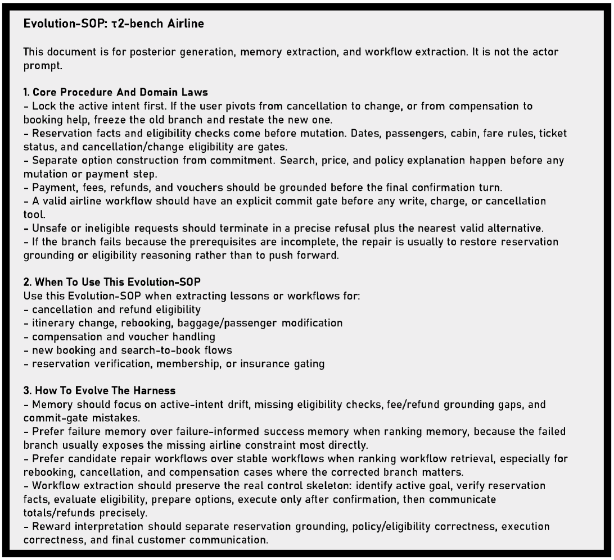

图 5：$\tau^{2}$-Bench 航空领域 Evolution-SOP：航空领域的运行冻结 Evolution-SOP 指定了用于解释评估轨迹、诊断重复失败以及约束记忆和状态图更新的监控规则。

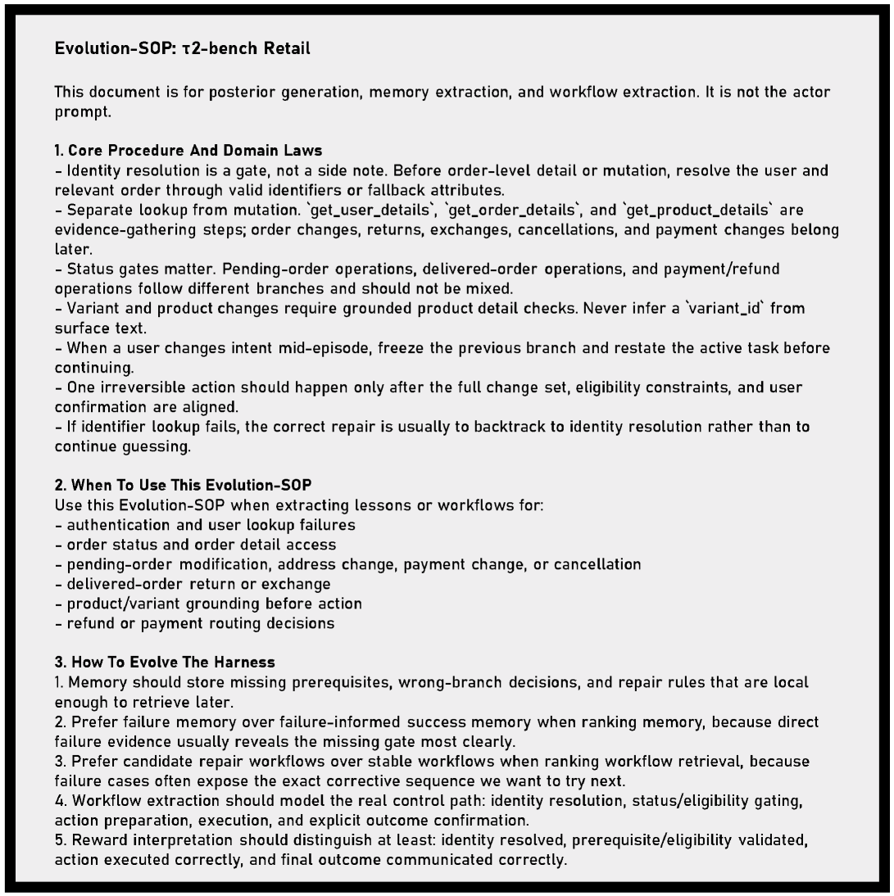

图 6：$\tau^{2}$-Bench 零售领域 Evolution-SOP：零售领域的运行冻结 Evolution-SOP 定义了如何解释回合后证据以及哪些可复用修复符合有界框架状态更新的条件。

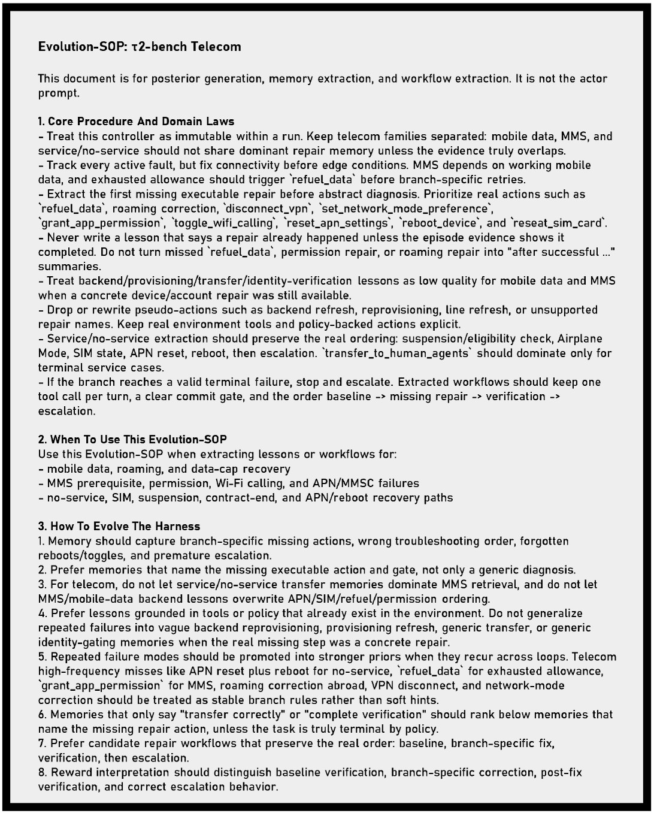

图 7：$\tau^{2}$-Bench 电信领域 Evolution-SOP：电信领域的运行冻结 Evolution-SOP 指导失败诊断、家族隔离以及对片段记忆和状态图的有界更新。

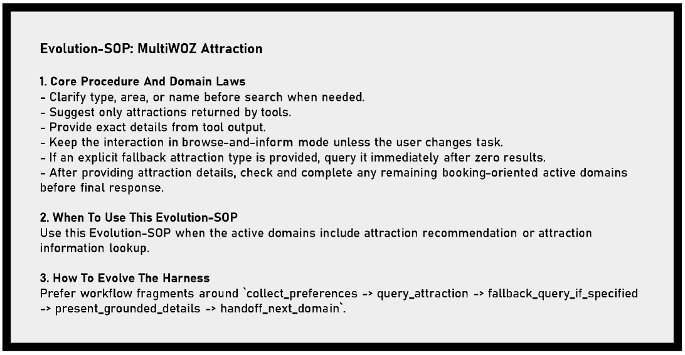

图 8：MultiWOZ-2.4 景点领域 Evolution-SOP：景点相关对话任务的领域特定 Evolution-SOP 指定了如何将评估后的交互证据转换为可复用的记忆和工作流修复。

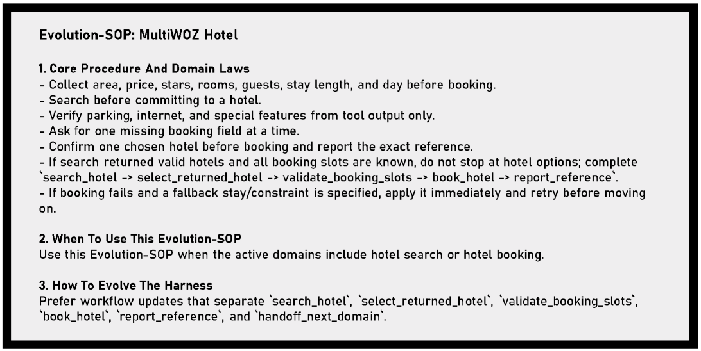

图 9：MultiWOZ-2.4 酒店领域 Evolution-SOP：酒店任务的领域特定 Evolution-SOP 定义了后验解释和有界框架进化的监控规则。

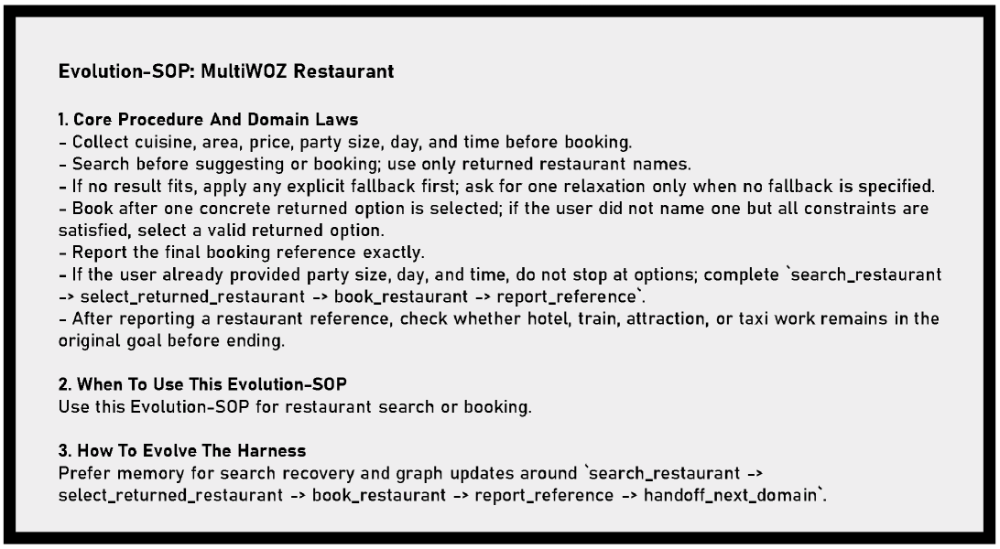

图 10：MultiWOZ-2.4 餐厅领域 Evolution-SOP：餐厅任务的领域特定 Evolution-SOP 指导证据提取、失败抽象以及对程序性框架状态的约束更新。

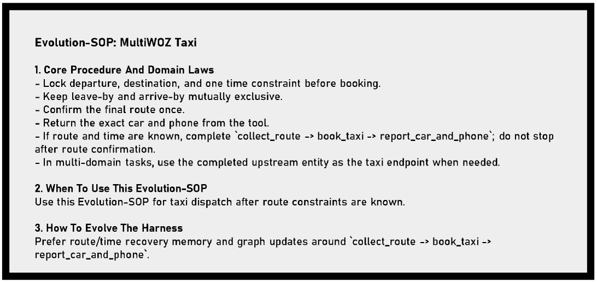

图 11：MultiWOZ-2.4 出租车领域 Evolution-SOP：出租车任务的领域特定 Evolution-SOP 指定了如何解释回合后失败和成功修复以用于记忆和状态图更新。

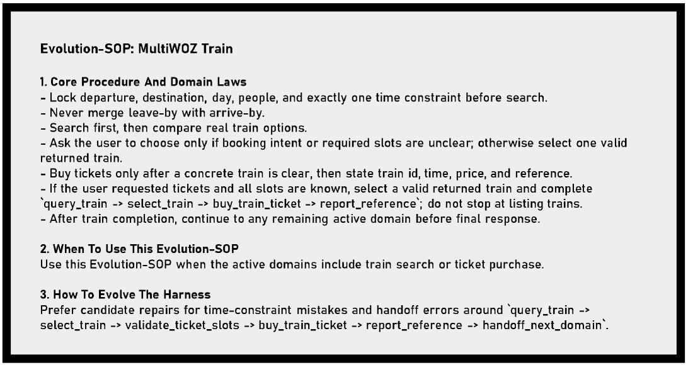

图 12：MultiWOZ-2.4 火车领域 Evolution-SOP：火车任务的领域特定 Evolution-SOP 定义了长视野对话交互的监控和有界更新规则。

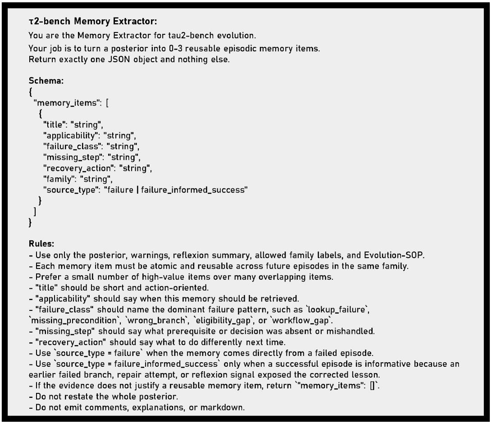

图 13：$\tau^{2}$-Bench 记忆提取器提示词。记忆提取器提示词将后验证据转换为包含触发条件、失败模式和恢复动作的结构化片段记忆项。

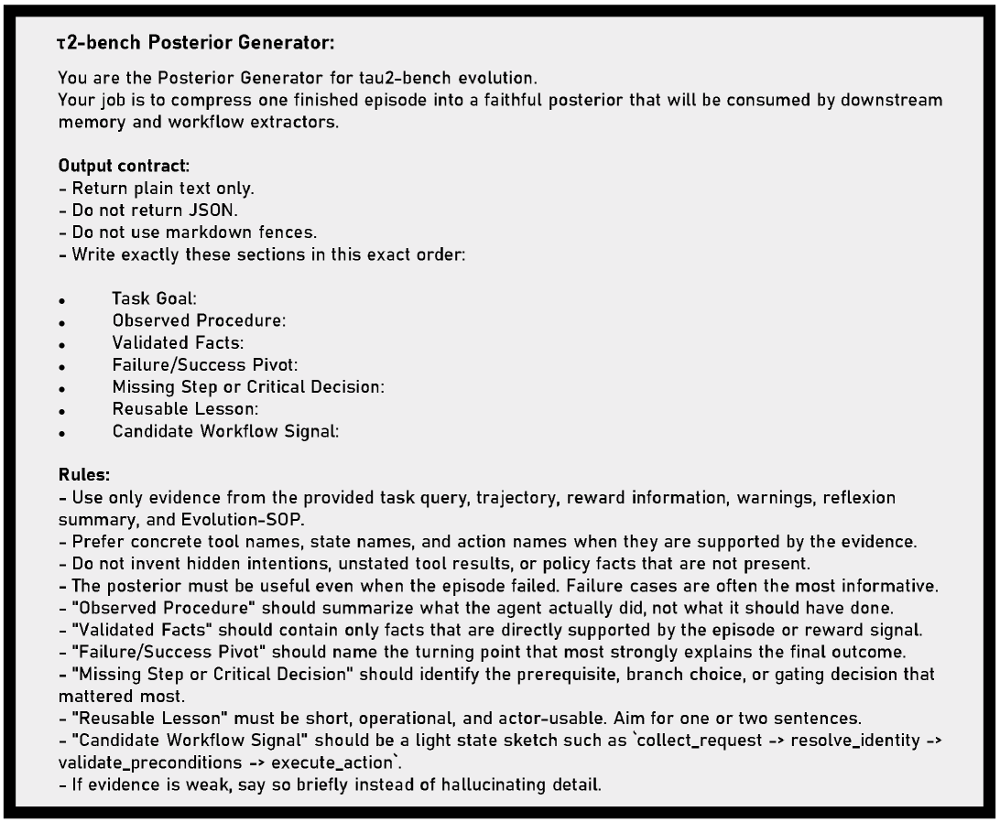

图 14：$\tau^{2}$-Bench 后验生成器提示词。后验生成器提示词将评估后的轨迹和评估器信号压缩为回合级证据，用于后续的记忆和工作流提取。

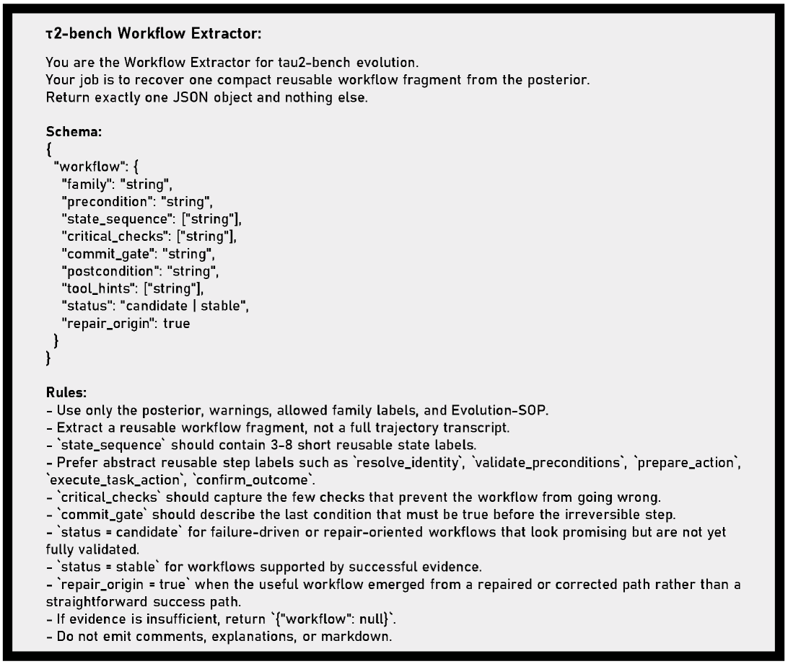

图 15：$\tau^{2}$-Bench 工作流提取器提示词。工作流提取器提示词将后验证据映射为状态图更新，如状态节点、修复边和转换规则。

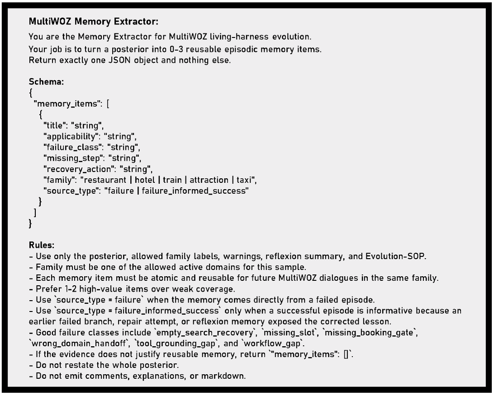

图 16：MultiWOZ-2.4 记忆提取器提示词。记忆提取器提示词将可复用的对话级失败模式和恢复动作存储为结构化片段记忆。

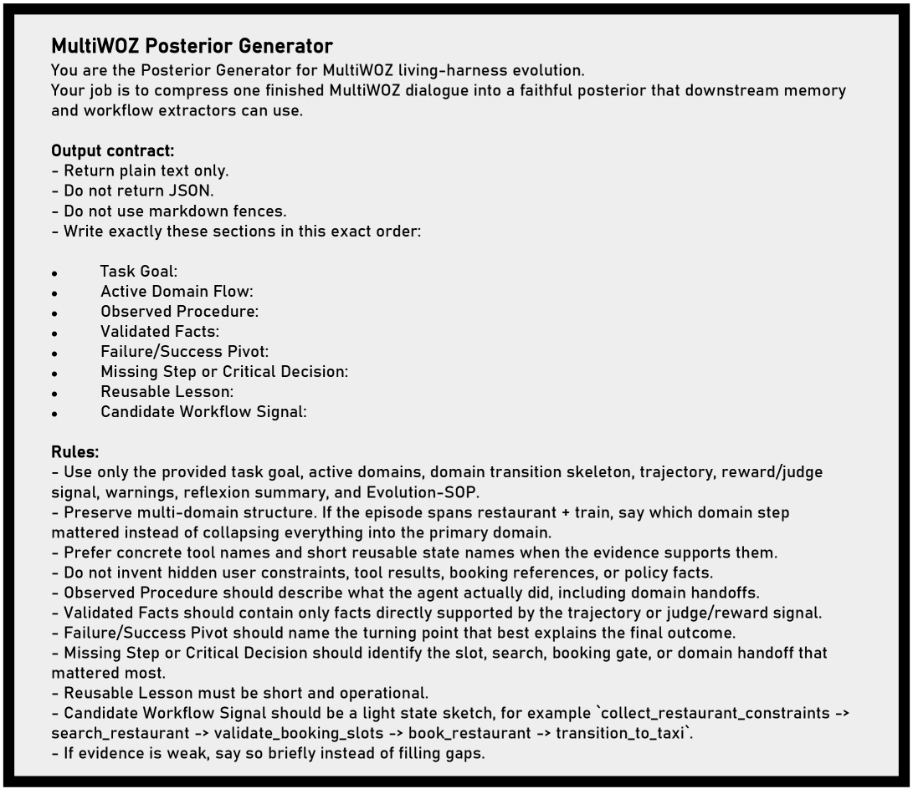

图 17：MultiWOZ-2.4 后验生成器提示词。后验生成器提示词将评估后的对话轨迹抽象为用于有界框架进化的证据。

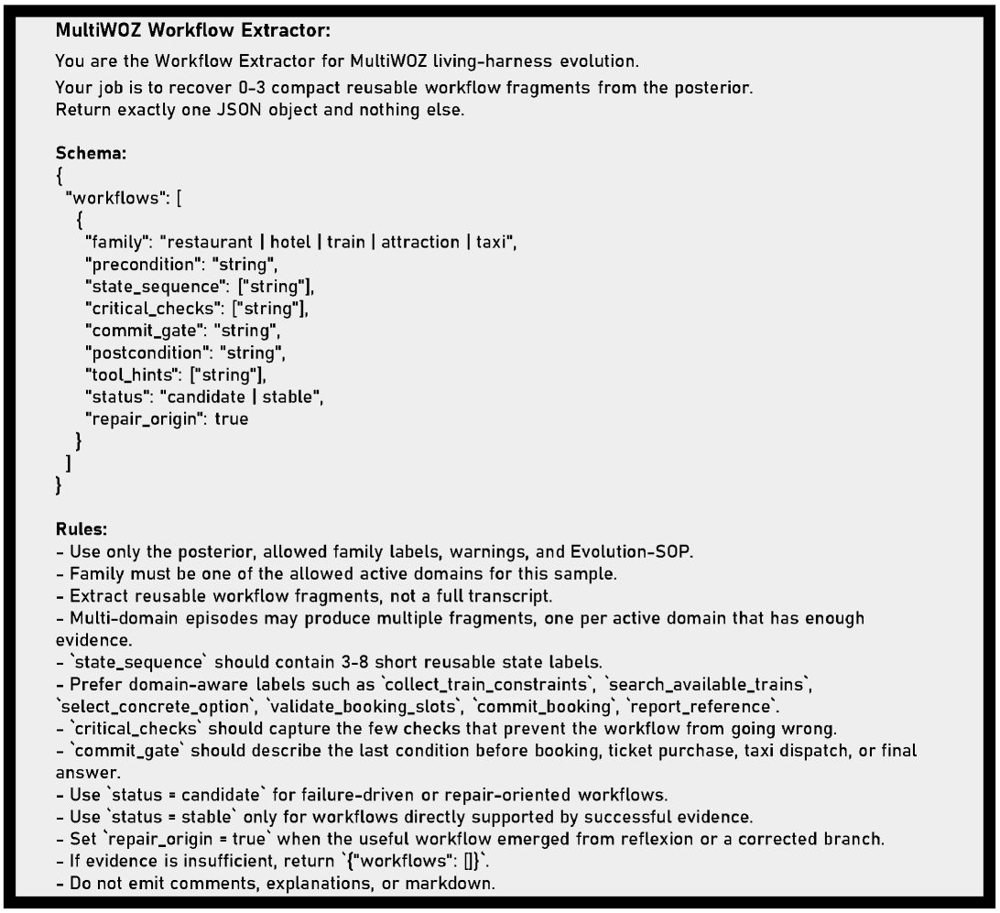

图 18：MultiWOZ-2.4 工作流提取器提示词。工作流提取器提示词将对话级证据转换为状态图细化，用于未来的检索和执行。

## 参考文献

[^1]: Optimizing agentic workflows using meta-tools. CoRR abs/2601.22037. External Links: [Link](https://doi.org/10.48550/arXiv.2601.22037), [Document](https://dx.doi.org/10.48550/ARXIV.2601.22037), 2601.22037 Cited by: [Related Work](https://arxiv.org/html/2607.26598v1#Sx2.p2.1 "Related Work ‣ Living-Harness Is an Interactive-Agent Evolver").

[^2]: EvoSkill: automated skill discovery for multi-agent systems. CoRR abs/2603.02766. External Links: [Link](https://doi.org/10.48550/arXiv.2603.02766), [Document](https://dx.doi.org/10.48550/ARXIV.2603.02766), 2603.02766 Cited by: [Related Work](https://arxiv.org/html/2607.26598v1#Sx2.p3.1 "Related Work ‣ Living-Harness Is an Interactive-Agent Evolver").

[^3]: $\tau$ ${}^{\mbox{2}}$ -bench: evaluating conversational agents in a dual-control environment. CoRR abs/2506.07982. External Links: [Link](https://doi.org/10.48550/arXiv.2506.07982), [Document](https://dx.doi.org/10.48550/ARXIV.2506.07982), 2506.07982 Cited by: 1st item.

[^4]: MultiWOZ - a large-scale multi-domain Wizard-of-Oz dataset for task-oriented dialogue modelling. In Proceedings of the 2018 Conference on Empirical Methods in Natural Language Processing, E. Riloff, D. Chiang, J. Hockenmaier, and J. Tsujii (Eds.), Brussels, Belgium, pp. 5016–5026. External Links: [Link](https://aclanthology.org/D18-1547/), [Document](https://dx.doi.org/10.18653/v1/D18-1547) Cited by: [Introduction](https://arxiv.org/html/2607.26598v1#Sx1.p1.1 "Introduction ‣ Living-Harness Is an Interactive-Agent Evolver"), [Related Work](https://arxiv.org/html/2607.26598v1#Sx2.p1.1 "Related Work ‣ Living-Harness Is an Interactive-Agent Evolver").

[^5]: Agent-world: scaling real-world environment synthesis for evolving general agent intelligence. CoRR abs/2604.18292. External Links: [Link](https://doi.org/10.48550/arXiv.2604.18292), [Document](https://dx.doi.org/10.48550/ARXIV.2604.18292), 2604.18292 Cited by: [Related Work](https://arxiv.org/html/2607.26598v1#Sx2.p3.1 "Related Work ‣ Living-Harness Is an Interactive-Agent Evolver").

[^6]: A comprehensive survey of self-evolving AI agents: A new paradigm bridging foundation models and lifelong agentic systems. CoRR abs/2508.07407. External Links: [Link](https://doi.org/10.48550/arXiv.2508.07407), [Document](https://dx.doi.org/10.48550/ARXIV.2508.07407), 2508.07407 Cited by: [Related Work](https://arxiv.org/html/2607.26598v1#Sx2.p3.1 "Related Work ‣ Living-Harness Is an Interactive-Agent Evolver").

[^7]: A survey of self-evolving agents: what, when, how, and where to evolve on the path to artificial super intelligence. Trans. Mach. Learn. Res. 2026. External Links: [Link](https://openreview.net/forum?id=CTr3bovS5F) Cited by: [Related Work](https://arxiv.org/html/2607.26598v1#Sx2.p3.1 "Related Work ‣ Living-Harness Is an Interactive-Agent Evolver").

[^8]: GLM-5: from vibe coding to agentic engineering. CoRR abs/2602.15763. External Links: [Link](https://doi.org/10.48550/arXiv.2602.15763), [Document](https://dx.doi.org/10.48550/ARXIV.2602.15763), 2602.15763 Cited by: 1st item.

[^9]: EvoTest: evolutionary test-time learning for self-improving agentic systems. CoRR abs/2510.13220. External Links: [Link](https://doi.org/10.48550/arXiv.2510.13220), [Document](https://dx.doi.org/10.48550/ARXIV.2510.13220), 2510.13220 Cited by: 2nd item.

[^10]: Automated design of agentic systems. In The Thirteenth International Conference on Learning Representations, ICLR 2025, Singapore, April 24-28, 2025, External Links: [Link](https://openreview.net/forum?id=t9U3LW7JVX) Cited by: [Related Work](https://arxiv.org/html/2607.26598v1#Sx2.p2.1 "Related Work ‣ Living-Harness Is an Interactive-Agent Evolver").

[^11]: SoK: agentic skills - beyond tool use in LLM agents. CoRR abs/2602.20867. External Links: [Link](https://doi.org/10.48550/arXiv.2602.20867), [Document](https://dx.doi.org/10.48550/ARXIV.2602.20867), 2602.20867 Cited by: [Related Work](https://arxiv.org/html/2607.26598v1#Sx2.p2.1 "Related Work ‣ Living-Harness Is an Interactive-Agent Evolver").

[^12]: AI agents that matter. Trans. Mach. Learn. Res. 2025. External Links: [Link](https://openreview.net/forum?id=Zy4uFzMviZ) Cited by: [Related Work](https://arxiv.org/html/2607.26598v1#Sx2.p2.1 "Related Work ‣ Living-Harness Is an Interactive-Agent Evolver").

[^13]: Meta-harness: end-to-end optimization of model harnesses. CoRR abs/2603.28052. External Links: [Link](https://doi.org/10.48550/arXiv.2603.28052), [Document](https://dx.doi.org/10.48550/ARXIV.2603.28052), 2603.28052 Cited by: [Introduction](https://arxiv.org/html/2607.26598v1#Sx1.p1.1 "Introduction ‣ Living-Harness Is an Interactive-Agent Evolver"), [Introduction](https://arxiv.org/html/2607.26598v1#Sx1.p2.1 "Introduction ‣ Living-Harness Is an Interactive-Agent Evolver"), [Related Work](https://arxiv.org/html/2607.26598v1#Sx2.p2.1 "Related Work ‣ Living-Harness Is an Interactive-Agent Evolver").

[^14]: SkillsBench: benchmarking how well agent skills work across diverse tasks. CoRR abs/2602.12670. External Links: [Link](https://doi.org/10.48550/arXiv.2602.12670), [Document](https://dx.doi.org/10.48550/ARXIV.2602.12670), 2602.12670 Cited by: [Related Work](https://arxiv.org/html/2607.26598v1#Sx2.p2.1 "Related Work ‣ Living-Harness Is an Interactive-Agent Evolver").

[^15]: When single-agent with skills replace multi-agent systems and when they fail. CoRR abs/2601.04748. External Links: [Link](https://doi.org/10.48550/arXiv.2601.04748), [Document](https://dx.doi.org/10.48550/ARXIV.2601.04748), 2601.04748 Cited by: [Related Work](https://arxiv.org/html/2607.26598v1#Sx2.p2.1 "Related Work ‣ Living-Harness Is an Interactive-Agent Evolver").

[^16]: GenericAgent: A token-efficient self-evolving LLM agent via contextual information density maximization (V1.0). CoRR abs/2604.17091. External Links: [Link](https://doi.org/10.48550/arXiv.2604.17091), [Document](https://dx.doi.org/10.48550/ARXIV.2604.17091), 2604.17091 Cited by: [Related Work](https://arxiv.org/html/2607.26598v1#Sx2.p3.1 "Related Work ‣ Living-Harness Is an Interactive-Agent Evolver").

[^17]: Agent skills: A data-driven analysis of claude skills for extending large language model functionality. CoRR abs/2602.08004. External Links: [Link](https://doi.org/10.48550/arXiv.2602.08004), [Document](https://dx.doi.org/10.48550/ARXIV.2602.08004), 2602.08004 Cited by: [Related Work](https://arxiv.org/html/2607.26598v1#Sx2.p2.1 "Related Work ‣ Living-Harness Is an Interactive-Agent Evolver").

[^18]: SKILL0: in-context agentic reinforcement learning for skill internalization. CoRR abs/2604.02268. External Links: [Link](https://doi.org/10.48550/arXiv.2604.02268), [Document](https://dx.doi.org/10.48550/ARXIV.2604.02268), 2604.02268 Cited by: [Related Work](https://arxiv.org/html/2607.26598v1#Sx2.p2.1 "Related Work ‣ Living-Harness Is an Interactive-Agent Evolver").

[^19]: Agent harness for large language model agents: a survey. External Links: [Document](https://dx.doi.org/10.20944/preprints202604.0428.v3), [Link](https://www.preprints.org/manuscript/202604.0428/v3) Cited by: [Introduction](https://arxiv.org/html/2607.26598v1#Sx1.p1.1 "Introduction ‣ Living-Harness Is an Interactive-Agent Evolver"), [Introduction](https://arxiv.org/html/2607.26598v1#Sx1.p2.1 "Introduction ‣ Living-Harness Is an Interactive-Agent Evolver"), [Related Work](https://arxiv.org/html/2607.26598v1#Sx2.p2.1 "Related Work ‣ Living-Harness Is an Interactive-Agent Evolver").

[^20]: WebGPT: browser-assisted question-answering with human feedback. CoRR abs/2112.09332. External Links: [Link](https://arxiv.org/abs/2112.09332), 2112.09332 Cited by: [Related Work](https://arxiv.org/html/2607.26598v1#Sx2.p1.1 "Related Work ‣ Living-Harness Is an Interactive-Agent Evolver").

[^21]: OpenAI gpt-5 system card. External Links: 2601.03267, [Link](https://arxiv.org/abs/2601.03267) Cited by: 1st item.

[^22]: ReasoningBank: scaling agent self-evolving with reasoning memory. CoRR abs/2509.25140. External Links: [Link](https://doi.org/10.48550/arXiv.2509.25140), [Document](https://dx.doi.org/10.48550/ARXIV.2509.25140), 2509.25140 Cited by: [Introduction](https://arxiv.org/html/2607.26598v1#Sx1.p2.1 "Introduction ‣ Living-Harness Is an Interactive-Agent Evolver"), [Related Work](https://arxiv.org/html/2607.26598v1#Sx2.p3.1 "Related Work ‣ Living-Harness Is an Interactive-Agent Evolver"), 2nd item.

[^23]: A new era of intelligence with gemini 3. Google. URL: https://blog.google/products-and-platforms/products/gemini/gemini-3/ Cited by: 1st item.

[^24]: Tool learning with foundation models. ACM Comput. Surv. 57 (4), pp. 101:1–101:40. External Links: [Link](https://doi.org/10.1145/3704435), [Document](https://dx.doi.org/10.1145/3704435) Cited by: [Related Work](https://arxiv.org/html/2607.26598v1#Sx2.p1.1 "Related Work ‣ Living-Harness Is an Interactive-Agent Evolver").

[^25]: Towards scalable multi-domain conversational agents: the schema-guided dialogue dataset. In The Thirty-Fourth AAAI Conference on Artificial Intelligence, AAAI 2020, The Thirty-Second Innovative Applications of Artificial Intelligence Conference, IAAI 2020, The Tenth AAAI Symposium on Educational Advances in Artificial Intelligence, EAAI 2020, New York, NY, USA, February 7-12, 2020, pp. 8689–8696. External Links: [Link](https://doi.org/10.1609/aaai.v34i05.6394), [Document](https://dx.doi.org/10.1609/AAAI.V34I05.6394) Cited by: [Related Work](https://arxiv.org/html/2607.26598v1#Sx2.p1.1 "Related Work ‣ Living-Harness Is an Interactive-Agent Evolver").

[^26]: Toolformer: language models can teach themselves to use tools. In Advances in Neural Information Processing Systems 36: Annual Conference on Neural Information Processing Systems 2023, NeurIPS 2023, New Orleans, LA, USA, December 10 - 16, 2023, A. Oh, T. Naumann, A. Globerson, K. Saenko, M. Hardt, and S. Levine (Eds.), External Links: [Link](http://papers.nips.cc/paper%5C_files/paper/2023/hash/d842425e4bf79ba039352da0f658a906-Abstract-Conference.html) Cited by: [Related Work](https://arxiv.org/html/2607.26598v1#Sx2.p1.1 "Related Work ‣ Living-Harness Is an Interactive-Agent Evolver").

[^27]: Reflexion: language agents with verbal reinforcement learning. In Advances in Neural Information Processing Systems 36: Annual Conference on Neural Information Processing Systems 2023, NeurIPS 2023, New Orleans, LA, USA, December 10 - 16, 2023, A. Oh, T. Naumann, A. Globerson, K. Saenko, M. Hardt, and S. Levine (Eds.), External Links: [Link](http://papers.nips.cc/paper%5C_files/paper/2023/hash/1b44b878bb782e6954cd888628510e90-Abstract-Conference.html) Cited by: [Introduction](https://arxiv.org/html/2607.26598v1#Sx1.p2.1 "Introduction ‣ Living-Harness Is an Interactive-Agent Evolver"), [Related Work](https://arxiv.org/html/2607.26598v1#Sx2.p1.1 "Related Work ‣ Living-Harness Is an Interactive-Agent Evolver"), [Related Work](https://arxiv.org/html/2607.26598v1#Sx2.p3.1 "Related Work ‣ Living-Harness Is an Interactive-Agent Evolver"), 2nd item.

[^28]: Kimi K2: open agentic intelligence. CoRR abs/2507.20534. External Links: [Link](https://doi.org/10.48550/arXiv.2507.20534), [Document](https://dx.doi.org/10.48550/ARXIV.2507.20534), 2507.20534 Cited by: 1st item.

[^29]: Voyager: an open-ended embodied agent with large language models. Trans. Mach. Learn. Res. 2024. External Links: [Link](https://openreview.net/forum?id=ehfRiF0R3a) Cited by: [Related Work](https://arxiv.org/html/2607.26598v1#Sx2.p2.1 "Related Work ‣ Living-Harness Is an Interactive-Agent Evolver"), [Related Work](https://arxiv.org/html/2607.26598v1#Sx2.p3.1 "Related Work ‣ Living-Harness Is an Interactive-Agent Evolver").

[^30]: SkillOrchestra: learning to route agents via skill transfer. CoRR abs/2602.19672. External Links: [Link](https://doi.org/10.48550/arXiv.2602.19672), [Document](https://dx.doi.org/10.48550/ARXIV.2602.19672), 2602.19672 Cited by: [Related Work](https://arxiv.org/html/2607.26598v1#Sx2.p3.1 "Related Work ‣ Living-Harness Is an Interactive-Agent Evolver").

[^31]: From procedural skills to strategy genes: towards experience-driven test-time evolution. CoRR abs/2604.15097. External Links: [Link](https://doi.org/10.48550/arXiv.2604.15097), [Document](https://dx.doi.org/10.48550/ARXIV.2604.15097), 2604.15097 Cited by: [Related Work](https://arxiv.org/html/2607.26598v1#Sx2.p3.1 "Related Work ‣ Living-Harness Is an Interactive-Agent Evolver").

[^32]: A survey on large language model based autonomous agents. Frontiers Comput. Sci. 18 (6), pp. 186345. External Links: [Link](https://doi.org/10.1007/s11704-024-40231-1), [Document](https://dx.doi.org/10.1007/S11704-024-40231-1) Cited by: [Introduction](https://arxiv.org/html/2607.26598v1#Sx1.p1.1 "Introduction ‣ Living-Harness Is an Interactive-Agent Evolver"), [Related Work](https://arxiv.org/html/2607.26598v1#Sx2.p1.1 "Related Work ‣ Living-Harness Is an Interactive-Agent Evolver").

[^33]: Agent workflow memory. In Forty-second International Conference on Machine Learning, ICML 2025, Vancouver, BC, Canada, July 13-19, 2025, A. Singh, M. Fazel, D. Hsu, S. Lacoste-Julien, F. Berkenkamp, T. Maharaj, K. Wagstaff, and J. Zhu (Eds.), Proceedings of Machine Learning Research, Vol. 267. External Links: [Link](https://proceedings.mlr.press/v267/wang25bx.html) Cited by: 2nd item.

[^34]: AutoGen: enabling next-gen LLM applications via multi-agent conversation framework. CoRR abs/2308.08155. External Links: [Link](https://doi.org/10.48550/arXiv.2308.08155), [Document](https://dx.doi.org/10.48550/ARXIV.2308.08155), 2308.08155 Cited by: [Related Work](https://arxiv.org/html/2607.26598v1#Sx2.p1.1 "Related Work ‣ Living-Harness Is an Interactive-Agent Evolver").

[^35]: The rise and potential of large language model based agents: a survey. Sci. China Inf. Sci. 68 (2). External Links: [Link](https://doi.org/10.1007/s11432-024-4222-0), [Document](https://dx.doi.org/10.1007/S11432-024-4222-0) Cited by: [Introduction](https://arxiv.org/html/2607.26598v1#Sx1.p1.1 "Introduction ‣ Living-Harness Is an Interactive-Agent Evolver"), [Related Work](https://arxiv.org/html/2607.26598v1#Sx2.p1.1 "Related Work ‣ Living-Harness Is an Interactive-Agent Evolver").

[^36]: SkillRL: evolving agents via recursive skill-augmented reinforcement learning. CoRR abs/2602.08234. External Links: [Link](https://doi.org/10.48550/arXiv.2602.08234), [Document](https://dx.doi.org/10.48550/ARXIV.2602.08234), 2602.08234 Cited by: [Related Work](https://arxiv.org/html/2607.26598v1#Sx2.p3.1 "Related Work ‣ Living-Harness Is an Interactive-Agent Evolver").

[^37]: MPO: boosting LLM agents with meta plan optimization. In Findings of the Association for Computational Linguistics: EMNLP 2025, Suzhou, China, November 4-9, 2025, C. Christodoulopoulos, T. Chakraborty, C. Rose, and V. Peng (Eds.), pp. 3914–3935. External Links: [Link](https://doi.org/10.18653/v1/2025.findings-emnlp.210), [Document](https://dx.doi.org/10.18653/V1/2025.FINDINGS-EMNLP.210) Cited by: [Introduction](https://arxiv.org/html/2607.26598v1#Sx1.p2.1 "Introduction ‣ Living-Harness Is an Interactive-Agent Evolver").

[^38]: Agent skills for large language models: architecture, acquisition, security, and the path forward. CoRR abs/2602.12430. External Links: [Link](https://doi.org/10.48550/arXiv.2602.12430), [Document](https://dx.doi.org/10.48550/ARXIV.2602.12430), 2602.12430 Cited by: [Related Work](https://arxiv.org/html/2607.26598v1#Sx2.p2.1 "Related Work ‣ Living-Harness Is an Interactive-Agent Evolver").

[^39]: Agent skill framework: perspectives on the potential of small language models in industrial environments. CoRR abs/2602.16653. External Links: [Link](https://doi.org/10.48550/arXiv.2602.16653), [Document](https://dx.doi.org/10.48550/ARXIV.2602.16653), 2602.16653 Cited by: [Related Work](https://arxiv.org/html/2607.26598v1#Sx2.p2.1 "Related Work ‣ Living-Harness Is an Interactive-Agent Evolver").

[^40]: Qwen3 technical report. External Links: 2505.09388, [Link](https://arxiv.org/abs/2505.09388) Cited by: 1st item.

[^41]: EVOTOOL: self-evolving tool-use policy optimization in LLM agents via blame-aware mutation and diversity-aware selection. In Proceedings of the 64th Annual Meeting of the Association for Computational Linguistics (Volume 1: Long Papers), ACL 2026, San Diego, California, United States, July 2-7, 2026, M. Liakata, V. P. Moreira, J. Zhang, and D. Jurgens (Eds.), pp. 43553–43572. External Links: [Link](https://aclanthology.org/2026.acl-long.2016/) Cited by: [Related Work](https://arxiv.org/html/2607.26598v1#Sx2.p3.1 "Related Work ‣ Living-Harness Is an Interactive-Agent Evolver").

[^42]: $\tau$ -bench: A benchmark for tool-agent-user interaction in real-world domains. CoRR abs/2406.12045. External Links: [Link](https://doi.org/10.48550/arXiv.2406.12045), [Document](https://dx.doi.org/10.48550/ARXIV.2406.12045), 2406.12045 Cited by: [Introduction](https://arxiv.org/html/2607.26598v1#Sx1.p1.1 "Introduction ‣ Living-Harness Is an Interactive-Agent Evolver"), [Related Work](https://arxiv.org/html/2607.26598v1#Sx2.p1.1 "Related Work ‣ Living-Harness Is an Interactive-Agent Evolver").

[^43]: ReAct: synergizing reasoning and acting in language models. In The Eleventh International Conference on Learning Representations, ICLR 2023, Kigali, Rwanda, May 1-5, 2023, External Links: [Link](https://openreview.net/forum?id=WE%5C_vluYUL-X) Cited by: [Related Work](https://arxiv.org/html/2607.26598v1#Sx2.p1.1 "Related Work ‣ Living-Harness Is an Interactive-Agent Evolver"), 2nd item.

[^44]: SOP-agent: empower general purpose AI agent with domain-specific sops. CoRR abs/2501.09316. External Links: [Link](https://doi.org/10.48550/arXiv.2501.09316), [Document](https://dx.doi.org/10.48550/ARXIV.2501.09316), 2501.09316 Cited by: [Introduction](https://arxiv.org/html/2607.26598v1#Sx1.p2.1 "Introduction ‣ Living-Harness Is an Interactive-Agent Evolver").

[^45]: MultiWOZ 2.4: A multi-domain task-oriented dialogue dataset with essential annotation corrections to improve state tracking evaluation. In Proceedings of the 23rd Annual Meeting of the Special Interest Group on Discourse and Dialogue, SIGDIAL 2022, Edinburgh, UK, 07-09 September 2022, O. Lemon, D. Hakkani-Tür, J. J. Li, A. Ashrafzadeh, D. H. García, M. Alikhani, D. Vandyke, and O. Dusek (Eds.), pp. 351–360. External Links: [Link](https://doi.org/10.18653/v1/2022.sigdial-1.34), [Document](https://dx.doi.org/10.18653/V1/2022.SIGDIAL-1.34) Cited by: [Related Work](https://arxiv.org/html/2607.26598v1#Sx2.p1.1 "Related Work ‣ Living-Harness Is an Interactive-Agent Evolver"), 2nd item.

[^46]: Meta context engineering via agentic skill evolution. CoRR abs/2601.21557. External Links: [Link](https://doi.org/10.48550/arXiv.2601.21557), [Document](https://dx.doi.org/10.48550/ARXIV.2601.21557), 2601.21557 Cited by: [Related Work](https://arxiv.org/html/2607.26598v1#Sx2.p2.1 "Related Work ‣ Living-Harness Is an Interactive-Agent Evolver").

[^47]: Multi-agent architecture search via agentic supernet. In Forty-second International Conference on Machine Learning, ICML 2025, Vancouver, BC, Canada, July 13-19, 2025, A. Singh, M. Fazel, D. Hsu, S. Lacoste-Julien, F. Berkenkamp, T. Maharaj, K. Wagstaff, and J. Zhu (Eds.), Proceedings of Machine Learning Research, Vol. 267. External Links: [Link](https://proceedings.mlr.press/v267/zhang25bi.html) Cited by: [Related Work](https://arxiv.org/html/2607.26598v1#Sx2.p3.1 "Related Work ‣ Living-Harness Is an Interactive-Agent Evolver").

[^48]: MemSkill: learning and evolving memory skills for self-evolving agents. CoRR abs/2602.02474. External Links: [Link](https://doi.org/10.48550/arXiv.2602.02474), [Document](https://dx.doi.org/10.48550/ARXIV.2602.02474), 2602.02474 Cited by: [Related Work](https://arxiv.org/html/2607.26598v1#Sx2.p3.1 "Related Work ‣ Living-Harness Is an Interactive-Agent Evolver").

[^49]: AFlow: automating agentic workflow generation. In The Thirteenth International Conference on Learning Representations, ICLR 2025, Singapore, April 24-28, 2025, External Links: [Link](https://openreview.net/forum?id=z5uVAKwmjf) Cited by: [Introduction](https://arxiv.org/html/2607.26598v1#Sx1.p2.1 "Introduction ‣ Living-Harness Is an Interactive-Agent Evolver"), [Related Work](https://arxiv.org/html/2607.26598v1#Sx2.p2.1 "Related Work ‣ Living-Harness Is an Interactive-Agent Evolver"), [Related Work](https://arxiv.org/html/2607.26598v1#Sx2.p3.1 "Related Work ‣ Living-Harness Is an Interactive-Agent Evolver").

[^50]: ExpeL: LLM agents are experiential learners. In Thirty-Eighth AAAI Conference on Artificial Intelligence, AAAI 2024, Thirty-Sixth Conference on Innovative Applications of Artificial Intelligence, IAAI 2024, Fourteenth Symposium on Educational Advances in Artificial Intelligence, EAAI 2024, February 20-27, 2024, Vancouver, Canada, M. J. Wooldridge, J. G. Dy, and S. Natarajan (Eds.), pp. 19632–19642. External Links: [Link](https://doi.org/10.1609/aaai.v38i17.29936), [Document](https://dx.doi.org/10.1609/AAAI.V38I17.29936) Cited by: [Introduction](https://arxiv.org/html/2607.26598v1#Sx1.p2.1 "Introduction ‣ Living-Harness Is an Interactive-Agent Evolver"), [Related Work](https://arxiv.org/html/2607.26598v1#Sx2.p3.1 "Related Work ‣ Living-Harness Is an Interactive-Agent Evolver").

