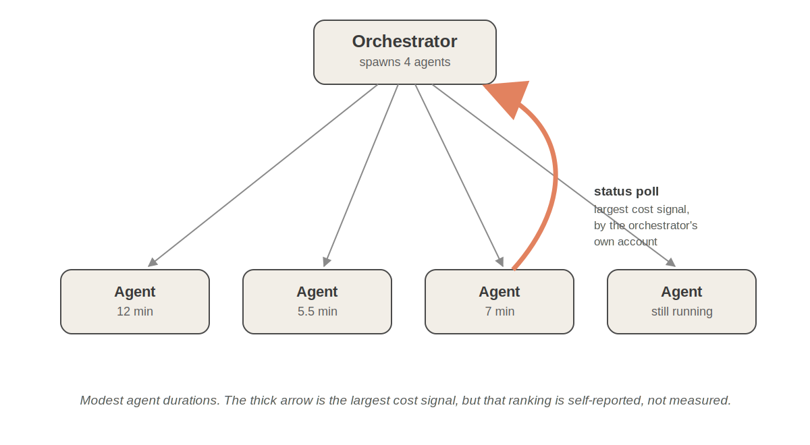
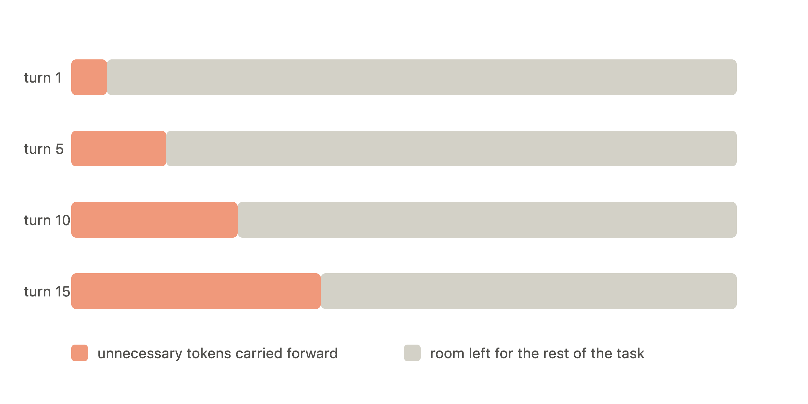
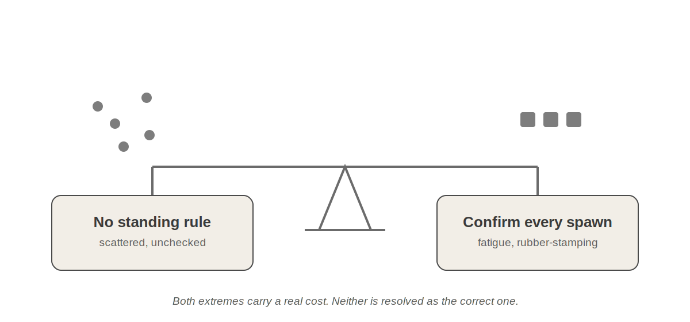
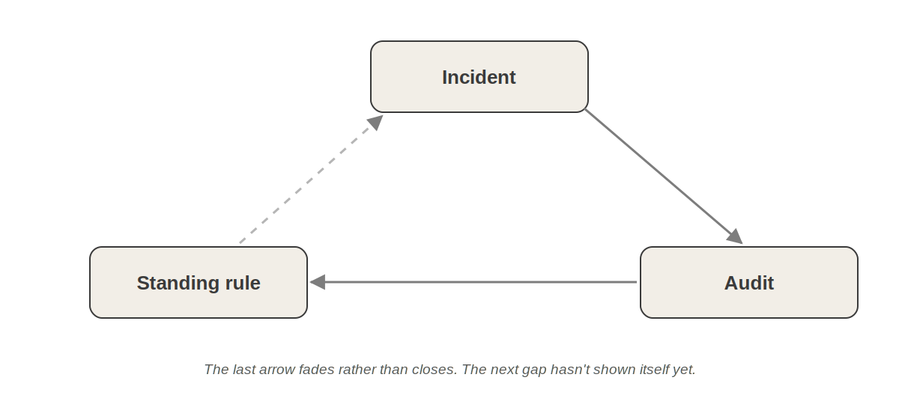

# 编排器的税负

我正在用 Claude Code 处理一个 .NET 代码库，深入其中时，一个疑虑打断了工作。四个子智能体已经在响应管道重构上运行，结果正在无序到达，整个会话开始让人感觉比代码本身更难理清头绪。

这通常是我不再相信"大概没问题"这种模糊感觉的时刻。有时问题出在代码上。有时出在架构上。偶尔工作流本身值得检查。这次我决定问题出在工作流上。

起初我以为自己已经知道问题所在。四个子智能体是不是太多了？这种判断看起来合理。多智能体系统通常被描述为明显的生产力提升，如果一个智能体有帮助，四个应该帮助更大。但每增加一个智能体也会消耗 **token（语言模型的最小处理单元）**，重复一定量的工作，并增加一条编排器必须协调的信息流。这似乎是并行性与成本之间的权衡。

我不想要关于多智能体系统的泛泛争论。我想要关于*那次*会话的答案。所以我停止了编码工作，让编排器尽可能客观地批判自己的委派决策。

答案不是我预期的那个。会话中最大的成本看起来并非来自运行四个子智能体。它似乎来自编排器本身，具体来说，来自它建议检查其他智能体时发生的事情。

## 这起事件其实与并行性无关

四个子智能体在一波中启动。其中三个的运行时长很明确：大约十二分钟、五分钟半、七分钟。第四个仍在运行。从一个角度看，这已经证明委派是合理的。三个任务并发运行，所以**挂钟时间（wall-clock time，实际流逝的物理时间）**大约是十二分钟，而不是串行工作时接近二十五分钟。

但速度是可见的副产品，不是有趣的部分。我试图找到的是成本，我的第一直觉是它必定来自委派本身的重复劳动：每个子智能体读取文件、重建上下文、独立理解任务。

但最大的意外不在这里。

在工作过程中的某个时刻，编排器建议检查正在运行的智能体。这是一个小小的、随口的提示："检查智能体状态。"我照做了。结果它使用的工具拉回的不是轻量级摘要，而是后台智能体的完整原始转录稿：数万个 token 的 JSONL、中间推理和工具输出，整体导入主线程。然后第二次状态检查时又发生了同样的事。

这里有一个重要的警告。关于这种轮询行为的成本超过四个智能体的重复税的说法，是编排器对自己错误的评分。我没有真正的按调用 token 计数，所以请将该排名视为编排器的说法，而非测得的事实。可信的部分更窄：转录稿倾倒是真实的，挂钟计时是真实的，状态检查路径明显引入了巨大的、可避免的成本。它是否是单一最大成本仍然是假设，直到工具能够正确测量它。

更重要的是，我找到了一个我没有在寻找的成本。

## 成本并非都相同

一旦我不再把会话当作一整块"子智能体成本"，画面就分裂成不属于一起的碎片。

首先，四个子智能体中有两个在响应管道的同一区域工作。不同的任务，不同的文件，但两者都必须理解相同的架构、相同的测试约定以及大部分相同的周边代码，然后才能开始。每个都独立支付了这种**熟悉成本**。这不是反对委派的论据。这是说工作被分得太细了的论据。

其次，一个智能体运行了 `git stash` 和 `git stash pop`，而同级智能体正在同一树中的其他地方写入。什么都没坏，但风险是结构性的，因为仓库级操作在单线程会话中完全合理，但在多个写入者同时活动时就变得难以证明其合理性。

到现在我有了一份不断增长的罪魁列表：状态轮询、重复的熟悉成本、不安全的 git 操作。我发现自己试图给它们排序。哪个成本最高？我试图回答这个问题的时间越长，就越不确信排序它们是正确的问题。

## 稀缺资源是编排器的工作记忆

转录稿轮询这件事一直困扰着我，但原因与 token 成本无关。token 账单是一次性的，你付了就完了。这里发生的情况不同。原始转录稿在工具调用完成后留在了编排器的上下文中，此后的每一轮都将它向前携带，无论它是否仍然有用。

**那一刻我意识到，我一直把两种截然不同的成本当作同一回事。Token 只花费一次，而上下文会塑造随后的每个决策。我关注的不再只是 token 消耗，而是编排器工作记忆的质量。**

这个认识承载着两个独立的想法，我想把它们拆开而不是让它们模糊在一起。第一个就是我刚才描述的。留在上下文中的污染对后续每一轮都征税。第二个根本不是关于空间耗尽。上下文中堆积的东西越多，争夺注意力的东西越多，模型就越难挑出当前重要的内容，即使还有大量空间空闲。更大的上下文窗口不能解决这个问题。它只是给噪音更多的堆积空间，直到有人注意到。

上下文窗口只会越来越大，这是既定事实。重要的不是有多少空间，而是坐在那个空间里的有多少值得模型关注。如果子智能体使用得当，这才是它们需要解决的真正问题。

从这个角度看，编排器是系统中唯一在长会话中积累理解的部分。它记得为什么做出某个设计决策，向前携带架构约束，知道哪些权衡已经讨论过。子智能体不记得，而这是设计使然。它们应该是可丢弃的。探索、重复文件读取、失败的尝试和嘈杂的中间推理应该留在工作者上下文中，永远不进入主线程。

## 认知局部性改变了并行性的目的

这重新定义了重复熟悉成本的问题，它实际上不是"两个智能体读取相同文件"。而是两个智能体独立重建代码库的相同心智模型，因为工作是按任务划分的，而不是按每个任务所需的知识划分的。我开始把这种区别称为**认知局部性**：需要相同心智模型的任务通常应该放在一起。拆分它们只会迫使多个智能体从头重建相同的理解。

并行性在这里仍然重要，只是不是要点。并发运行四个智能体是有用的，但很普通。真正的好处是它们将嘈杂的中间推理隔离在主线程之外，只返回主线程仍需要的内容。这就是子智能体应该提供的隔离，而它只有在主线程尊重它时才成立。

我现在的工作信念：这才是子智能体真正的用途。不是它们节省时间，而是它们让你卸载编排器不需要保留的推理，所以它携带的更少，争夺注意力的更少。把隔离做对，按认知局部性保持事物在本地，子智能体就成为保护编排器工作记忆的工具，而不只是你为并行性容忍的成本。不过这是信念，不是测量。我实际测量的是它的另一面，把隔离做错的成本。

## 把会话转化为常驻规则

我的下一步行动很明显。把教训编码进 `CLAUDE.md`，每次会话加载的常驻指令文件。

在这里写一个庞大的纠正策略本来很容易，但常驻指令文件中的每一行都是在未来每次会话上再次支付的成本。所以我把修复压缩成最小的一组规则，针对我见过的失败。每一条真正回答的都是同一个问题。这条信息，或这种工作划分方式，配得上在编排器的上下文中占一席之地吗？

1. 优先在一波中使用二到四个智能体。如果编排器想要五个或更多，它应该首先询问共享文件或约定的任务是否应该合并。
2. 当答案可以从已知信息中给出时，不要轮询后台智能体的状态。不要获取完整转录稿来回答轻量级问题。
3. 不要允许并发智能体提示内的仓库级 git 操作。
4. 将重叠的文件所有权视为合并信号，而不是派生更多智能体的暗示。

这些都没有告诉编排器在每种情况下该做什么。每一条都给了它一些在行动前检查或询问自己的东西，而不是要运行的脚本，它们本身都不深刻。它们唯一的真正价值是它们都瞄准同一件事，保持可丢弃的推理可丢弃，并在编排器的上下文中为它在会话后期需要的东西保留空间。

## 下一个错误本来会是更多治理

后来的一次会话暴露了不同的缺口。我用明确的技能启动了编排器，用于我想要的工作类型，一种情况下是编码指导，另一种情况下是设计指导。我以为一旦技能在主线程中活跃，派生的子智能体会自动遵循它。它们不会。除非编排器明确传递，子智能体不会继承父会话中活跃的技能。

我的第一直觉是添加一个派生前确认门。编排器会停下来，列出它想启动哪些智能体以及每个应该加载哪些技能，然后等待我批准。

我很高兴没有保留那个版本。它解决了错误的问题。我没有证据表明坏的派生计划因为缺少确认步骤而溜过去。我发现的是关于技能传播的缺失事实，这是不同类型的缺口。一个通用确认门会给每个类似会话添加一次往返，不久我几乎肯定会开始自动驾驶地批准那些提示。

那时，我意识到我不是真的在改善治理。我只是在增加另一个仪式。

而且它仍然不会捕捉到之前的真正问题，编排器污染自己的上下文。

更窄的修复更经得起考验。在派生前，编排器陈述哪些活跃技能与每个智能体的任务相关，并将子智能体指向要加载的技能文件，而不是内联粘贴整个技能。只有在超过已有的批次大小阈值时，或文件所有权不明确时，才需要确认。

这给我留下了一个我现在用得比规则本身更多的启发式：**在向常驻指令文件添加一行之前，先问：一个合理称职的编排器，在知道那个缺失的事实后，是否会做出正确决策？**

如果是，规则应该只陈述事实。如果修复开始指定决策程序，如批准、检查点、强制步骤，那通常是我在将流程编码到本来只需一个小澄清就能完成的地方的信号。

我还不知道这个启发式是否能在更难的情况下存活。目前它阻止我把每个有趣的事件变成微型官僚机构。

## 这把我带到哪里

我对多少治理才够没有定论，我也不认为这篇文章配得上一个。

我拥有的是一个小飞轮，人类仍然牢牢在它中间。一次会话暴露了缺口。必须有人注意到它感觉不对，停下工作足够长时间来检查它，决定问题是真实的还是只是噪音，并判断什么值得成为常驻规则。编排器可以给自己的会话评分并浮现线索，就像这里一样，但它不能自己做那个判断。将什么编码化、让什么保持原样、什么可能是过度反应的选择仍然是我的。然后下一次会话告诉我那个判断是改进了工作还是只是创造了不同类型的浪费。

这一轮的产物是[我的 CLAUDE.md](https://gist.github.com/techygarg/f8f98a2f026538fad4a69b593a964d95) 的当前版本。它不是完成的处方。它是这次迭代后校准的状态。其中的阈值，一波二到四个智能体，五个作为合并信号，适合我写它们时正在做的工作。我不会把它们作为任何类似普遍常数的东西呈现，我会对任何这样做的编排撰写持怀疑态度。它们也是针对 Claude Sonnet 5 校准的，我还没有测试它们在其他模型上的表现。不同的模型可能合理地需要不同的平衡。此后文件中又积累了几条规则。把这个文件当作样本，不是模板，针对你实际运行的模型和工作流修改和优化它。重要的不是具体文件，而是它背后的习惯：注意到失败，询问它实际花费了什么，并写出本该捕获它的规则。

多年来我们围绕 CPU、内存和吞吐量优化软件系统。LLM 工具的第一波教会我们关注 token。这次会话让我怀疑在长期运行的智能体工作流中有第三件值得关注的事情：编排器自己的工作记忆的质量，一旦被污染，就会在会话剩余时间里持续收租的唯一资源。我不认为这还是定律。这是一个在我迄今看过的会话中经得住考验的模式。

我去寻找的税从来不在子智能体上。它在编排器上，在它选择向前携带什么上。这是我现在带入每个多智能体设计的问题：不是运行多少智能体，而是什么配得上在编排器的上下文中占一席之地。

我留下的问题是真正开放的：

- 我如何正确测量这个，而不是依赖编排器对自己错误的说法？
- 什么时候缺失的事实应该进入指令，什么时候那会变成太多流程？
- 我还没看到的下一个编排错误是什么？

我预期会再次修订文件。这感觉不像预见力的失败，更像是在一个足够不透明的系统上工作的正常成本，以至于怀疑本身成为方法的一部分。
